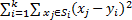

# Кластеризация методом k-средних

Кластеризация методом k-средних
-

# Кластеризация методом k-средних

Метод к-средних - один из методов кластеризации. Суть метода - разбиение объектов на кластеры таким способом, чтобы минимизировать сумму расстояний от объектов до соответствующих им центров кластеров:

Где:

-
k. Число кластеров;

-
Si. Полученные кластеры;

-
yi. Центры полученных кластеров.

В методе к-средних на каждой итерации пересчитывается центр масс кластера, полученного на предыдущем шаге, после чего объекты снова разбиваются на кластеры.

См. также:

[ISmKmeansClusterAnalysis](StatLib.chm::/Interface/ISmKmeansClusterAnalysis/ISmKmeansClusterAnalysis.htm) | [Библиотека методов и моделей](../uimodelling_lib_common.htm)

		Справочная
		 система на версию 10.9
		 от 18/08/2025,
		 © ООО «ФОРСАЙТ»,
