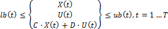

# Задача оптимального управления с учетом ограничений

Задача оптимального управления с учетом ограничений
-

# Задача оптимального управления с учетом ограничений

Процесс постановки конкретной задачи оптимального управления включает
 в себя ряд этапов:

	- построение систем математических соотношений, описывающих управляемый
	 объект;

	- определение управляющего воздействия;

	- составление целевой функции и указание направления её оптимизации;

	- наложение ограничений на траекторию изменения системы и управляющее
	 воздействие;

	- определение периода оптимизации.

Примечание.
 Для решения задачи оптимального управления с учетом ограничений проведите
 [интеграцию
 с LPSolve](UiNav.chm::/02_Navigator/CommonSettings/Integration.htm#lpsolve).

В зависимости от вида рассматриваемого явления и желаемой степени детализации
 для построения математической модели могут использоваться различные типы
 уравнений: обыкновенные, дифференциальные, уравнения с последействием,
 стохастические уравнения, уравнения в частных производных и т.д.

Состояние объекта зависит от управления. Оптимальное управление выбирается
 так, чтобы оптимизировать целевую функцию задачи.

Необходимо отметить, что задачи оптимизации развития социально-экономических
 систем будут относиться к классу дискретных динамических задач управления.
 При этом в качестве шага может выступать месяц или год, в зависимости
 от поставленной задачи и наличия ретроспективных данных.

## Нелинейная задача оптимального управления

В общем виде нелинейную задачу оптимального управления можно представить
 следующим образом: состояние управляемого объекта в момент времени t описывается вектором фазовых
 координат х(t)
 и управлением u(t).
 Таким образом, процесс полностью определен, если задано управление u(t)
 (при t > t0, где t0 - начальный момент времени)
 и начальное фазовое состояние x0 = x(t0).

Входные параметры:

	- T.
	 Период оптимизации;

	- X(t). Вектор фазовых переменных {xi(t)}. Каждая переменная описывается
	 структурой вида:

	-

		- Fi(t). Выражение для вычисления
		 значения xi(t)
		 на всем периоде от 1 до T.
		 В общем случае, Fi(t) зависит от X(1),…,X(t-1)
		 и U(1),…,U(t);

		- x_Lbi(t), x_Ubi(t). Ограничения на диапазон допустимых
		 значений переменной на всем периоде от 1 до T;

		- Ri(t). Ретроспективные значения
		 фазовой переменной на периоде от 0, -1, -2,…, -MaxLag.

	- U(t). Вектор управляющих переменных
	 {uj(t)}, каждая переменная описывается
	 структурой вида:

	-

		- u_Lbj(t), u_Ubj(t). Ограничения на диапазон допустимых
		 значений управляющей переменной на всем периоде от 1 до T;

		- Rj(t). Ретроспективные значения
		 управляющей переменной на периоде от 0, -1, -2,… -MaxLag;

		- Initi(t). Начальное приближение на
		 каждый момент времени t = 1…T.

	- Exp.
	 Ограничения, накладываемые на связи фазовых и управляющих переменных:

	-

		- Expk(X(t),U(t)). Основная часть выражения;

		- e_Lb(t), e_Ub(t). Верхнее и нижнее ограничение
		 для t-го выражения t = 1…T.

	- ObjFun(X(t),U(t)). Целевая функция;

	- направление оптимизации.

	- параметры, описывающие технические детали вычисления:

	-

		- тип рекуррентного вычисления выражений (рекуррентная подстановка
		 значений, подстановка выражений);

		- набор параметров для метода оптимизации (метод оптимизации,
		 точность, максимальное число итераций).

Выходные параметры:

	- оптимальное значение целевой функции;

	- Ũ(t). Значения управляющих переменных,
	 отвечающие оптимальному значению целевой функции;

	- X̃(t). Значения фазовых переменных,
	 отвечающие оптимальному управлению Ũ(t).

Рассмотрим на примере простой задачи для
 Т = 4.

	- фазовые переменные:

	-

		- x1. Первая фазовая переменная;

		- x2. Вторая фазовая переменная.

	- управляющие переменные:

	-

		- u(t). Первая управляющая переменная;

		- v(t). Вторая управляющая переменная.

	- ограничения: -1000 < x1[t] * x2[t] + u[t] * v[t] < 1000;

	- целевая функция: ObjFun(X(4),U(4)) = х1[4]2 + х2[4]2.

Решение: задача сводится к задаче нелинейного программирования. Решение
 может быть найдено двумя способами:

	- с помощью рекуррентной подстановки значений. Для получения значения
	 целевой функции, последовательно вычисляются значения фазовых переменных
	 х1[t]
	 и х2[t]
	 от t = 1 до t = T.
	 Рекуррентную процедуру от t = 1
	 до t = T
	 требуется выполнять всякий раз, когда изменяются значения управляющих
	 переменных;

	- с помощью подстановки выражений. Для получения значения целевой
	 функции, последовательно выражаются значения фазовых переменных х1[t]
	 и х2[t]
	 от t = 1 до t = T.
	 На последнем шаге выражаются x1[4]
	 и x2[4]. Полученные выражения
	 подставляются в целевую функцию.

	Описанный процесс выполняется один раз в начале вычислений. В результате
	 из задачи исключаются фазовые переменные и остаются только управляющие
	 переменные. Недостаток такого подхода: очень быстрый рост размеров
	 выражений при увеличении количества переменных периода управления
	 T.

Оптимизация: полученная задача удовлетворяет условиям задачи нелинейного
 программирования относительно управляющих переменных U.
 В ней есть целевая функция и переменные, связанные ограничениями произвольного
 вида. Реализовано три метода оптимизации:

	- Поиск по сетке. Очень
	 трудоёмкий метод. Может использоваться на задачах маленькой размерности;

	- Нелинейный симплекс.
	 Не учитывает нелинейные условия на переменные, поэтому также может
	 использоваться только в ограниченном числе случаев;

	- Метод последовательного квадратичного
	 программирования. Метод решения задач нелинейного программирования.
	 Требует задания начальных приближений, по всем управляющим переменным.
	 Позволяет учесть нелинейные ограничения на управляющие переменные.

## Линейная задача оптимального управления

Является частным случаем нелинейной задачи с той разницей, что в линейной
 задаче все выражения являются линейными. Это позволяет применять для решения
 линейные методы оптимизации.

Аналогично нелинейной задаче, линейная задача состоит из целевой функции,
 набора уравнений, описывающих динамику и состояние фазовых переменных,
 ограничений, накладываемых на фазовые и управляемые переменные.

Введем обозначения:

	- X(t) - (k×1). Вектор, описывающий состояние
	 системы в момент времени t;

	- U(t) - (l×1). Вектор, управляющих переменных
	 в момент времени t;

	- k.
	 Количество фазовых переменных;

	- l.
	 Количество управляющих переменных.

Динамика системы описывается системой авторегрессионных уравнений:

X(t) = A1X(t-1) + ··· + ApX(t-p) + B0U(t) + B1U(t-1) + ··· +BqU(t-q), где t = 1…T

Состояние системы в момент времени t
 зависит от p предыдущих состояний,
 текущего управления U(t)
 и от q предыдущих управлений.

Требуется оптимизировать линейную функцию F(XT,UT) → extr при ограничениях:

И заданных начальных значениях: X(0), X(-1), …, X(-p+1), U(0), U(-1), …, U(-q+1)

В соответствии с целевой функцией оптимизация происходит за счет поиска
 значений управляющих переменных, обеспечивающих минимум целевой функции.

См. также:

[Библиотека методов и моделей](../uimodelling_lib_common.htm)
 | [ICpLinearOptimization](KeCp.chm::/Interface/ICpLinearOptimization/ICpLinearOptimization.htm)
 | [ICpNonLinearOptimization](KeCp.chm::/Interface/ICpNonLinearOptimization/ICpNonLinearOptimization.htm)

		Справочная
		 система на версию 10.9
		 от 18/08/2025,
		 © ООО «ФОРСАЙТ»,
