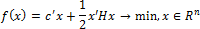

# Задача квадратичного программирования

Задача квадратичного программирования
-

# Задача квадратичного программирования

Квадратичное программирование – это задача оптимизации квадратичной функции нескольких переменных при линейных ограничениях на эти переменные.

Специфика задачи квадратичного программирования состоит в том, чтобы найти минимум квадратичной функции:

При ограничениях:

Где:

-
f(x). Функция n-переменных;

-
x. n-вектор переменных;

-
c. n-вектор линейной составляющей целевой функции;

-
H. n x n - симметричная матрица квадратичной части целевой функции;

-
A. m x n -матрица линейных ограничений, где m - число линейных ограничений;

-
l0, u0. n-векторы границ, определяющих прямые ограничения;

-
l, u. m-векторы границ, определяющих линейные ограничения.

Примечание.
 Для решения задачи квадратичного программирования должна быть проведена
 [интеграция
 с LPSolve](UiNav.chm::/02_Navigator/CommonSettings/Integration.htm#lpsolve).

См. также:

[Библиотека методов и моделей](../uimodelling_lib_common.htm) | [ISmQuadraticProgramming](StatLib.chm::/Interface/ISmQuadraticProgramming/ISmQuadraticProgramming.htm)

		Справочная
		 система на версию 10.9
		 от 18/08/2025,
		 © ООО «ФОРСАЙТ»,
