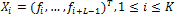
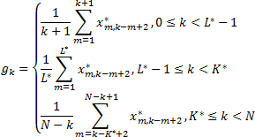

# Сингулярный спектральный анализ

Сингулярный спектральный анализ
-

# Сингулярный спектральный анализ

Сингулярный спектральный анализ (англ. *Singular spectrum
 analysis, SSA*) относится к непараметрическим методам анализа временных
 рядов. Целью метода является разложение временного ряда на интерпретируемые
 аддитивные составляющие. Метод не требует стационарности ряда, знания
 модели тренда, а также сведений о наличии в ряде периодических составляющих.
 При таких слабых предположениях метод может решать различные задачи, например,
 выделение тренда, обнаружение периодичной составляющей, сглаживание ряда.

Из-за отсутствия модели отсутствует возможность проверить гипотезу о
 наличии в ряде той или иной составляющей, но на основе информации, получаемой
 с помощью анализа, можно построить параметрическую модель для проверки
 гипотез.

Базовый алгоритм метода состоит из двух дополняющих друг друга этапов:
 разложение и восстановление.

Пусть F = (f1, …, fn)
 - вещественный временной ряд длины N
 (N > 2 ). Ряд F - ненулевой, то есть существует
 хотя бы одно i такое, что fi ≠ 0.

## Этап 1. Разложение

	- Вложение

На этом шаге исходный временной ряд преобразуется
 в последовательность многомерных векторов.

Пусть L
 - длина таких векторов: целое число, определяемое пользователем (1 < L < N).
 Процедура вложения образует K = N - L + 1
 векторов вложения

Таким образом, получаем L-траекторную
 матрицу ряда F: X = [X1; …; XK],
 которая состоит из векторов вложения в качестве столбцов.

	- Сингулярное разложение

Пусть S = (1/K)XXT. Пусть
 λ1; …; λL - собственные числа матрицы S, взятые в неубывающем порядке
 (λ1 ≥ … ≥ 0);
 U = [U1; …; UL] - ортогональная
 система собственных векторов матрицы S,
 соответствующих собственным числам.

Матрицу U
 можно рассматривать как матрицу перехода к [главным
 компонентам](UiModelling_PrincipalComponents.htm) XU = Y = (y1, …, yL).

## Этап 2. Восстановление

	- Выделение главных компонент

В силу свойств матрицы U
 возможно представить матрицу ряда X
 как X = YU'. Таким
 образом, получаем разложение матрицы ряда по главным компонентам. Разложение
 можно получить, используя не все главные компоненты, а только те, которые
 несут большую часть информации о ряде. В этом случае столбцы матрицы Y, соответствующие незначимым компонентам,
 будут заполнены нулями.

	- Восстановление одномерного
	 ряда

Восстановление производится путем процедуры
 диагонального усреднения.

Положим L* = min(L, K),
 K* = max(L, K), где L x K - размерность матрицы X.
 Тогда пусть x*ij = xij,
 если L < K, и x*ij = xji
 иначе. Процедура диагонального усреднения переводит матрицу X
 в результирующий ряд G = (g0, …, gN-1) по формулам:

Таким образом, базовый алгоритм позволяет
 сгладить исходный ряд F, отбросив
 его случайную составляющую (шумы).

См. также:

[Библиотека методов и моделей](../uimodelling_lib_common.htm)
 | [ISmSingularSpectrumAnalysis](StatLib.chm::/Interface/ISmSingularSpectrumAnalysis/ISmSingularSpectrumAnalysis.htm)

		Справочная
		 система на версию 10.9
		 от 18/08/2025,
		 © ООО «ФОРСАЙТ»,
