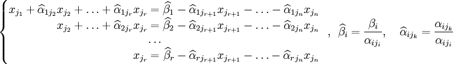

# Решение системы линейных уравнений. Метод Гаусса

Решение системы линейных уравнений. Метод Гаусса
-

**

# Решение системы линейных уравнений. Метод Гаусса

Метод Гаусса** - это способ решения
 системы линейных алгебраических уравнений (СЛАУ), который состоит в постепенном
 понижении порядка системы и исключении неизвестных.

Решение СЛАУ методом Гаусса состоит из двух этапов:

	- На первом этапе выполняется «прямой ход», когда путём простых
	 преобразований над строками систему приводят к ступенчатой или треугольной
	 форме, либо устанавливают, что система несовместна. Среди элементов
	 первого столбца матрицы отбирают ненулевой, перемещают его в крайнее
	 верхнее положение путем перестановки строк и вычитают получившуюся
	 после перестановки первую строку из оставшихся строк, домножив её
	 на величину, равную отношению первого элемента каждой из этих строк
	 к первому элементу первой строки, обнуляя тем самым столбец под ним.
	 Далее первую строку и первый столбец мысленно вычеркивают. Процесс
	 повторяют пока не останется матрица нулевого размера. Если на какой-то
	 из итераций среди элементов первого столбца не найден ненулевой, то
	 переходят к следующему столбцу и выполняют аналогичную операцию.

	- На втором этапе выполняется «обратный ход». Его суть в том,
	 чтобы выразить все получившиеся базисные переменные через небазисные
	 и построить фундаментальную систему решений. Если все переменные являются
	 базисными, то выразить в численном виде единственное решение системы
	 линейных уравнений. Эта процедура начинается с последнего уравнения.
	 Из него выражают соответствующую единственную базисную переменную
	 и подставляют в предыдущие уравнения. Затем так продолжают далее,
	 поднимаясь по «ступенькам» наверх. Каждой строчке соответствует только
	 одна базисная переменная, поэтому на каждом шаге, кроме последнего
	 (самого верхнего), ситуация повторяет случай последней строки.

Пусть есть исходная система, которая выглядит следующим образом:

* (1)

Матрица A*
 называется основной матрицей системы, а матрица *b* - столбцом свободных членов.

Согласно свойству элементарных преобразований над строками основную
 матрицу этой системы можно привести к ступенчатому виду. Эти же преобразования
 требуется применять к столбцу свободных членов:

*

При этом считаем, что базисный минор (ненулевой минор максимального
 порядка) основной матрицы находится в верхнем левом углу, т.е. в
 него входят только коэффициенты при переменных xj1, …, xjr.
 Такого расположения минора можно добиться путем перестановки столбцов
 основной матрицы и соответствующей перенумерацией переменных.

Таким образом, переменные xj1, …, xjr
 называются главными переменными*. Все остальные называются *свободными*.

Если хотя бы одно число βi ≠ 0, где *i*
 > *r*, то рассматриваемая система несовместна.

Пусть, что βi = 0 для любых *i* > *r*.

Перенесём свободные переменные за знаки равенств и поделим каждое из
 уравнений системы на свой коэффициент при самом левом  (αij, i = 1,
 …, r, где i
 — номер строки):

 (2)

Где i = 1, …, r, k = i + 1, …, n.

Если свободным переменным системы (2) придавать все допустимые значения
 и решать новую систему относительно главных неизвестных снизу вверх (т.е. от
 нижнего уравнения к верхнему), то в результате получим все решения этой
 СЛАУ. Так как эта система найдена путём элементарных преобразований над
 исходной системой (1), то по теореме об эквивалентности при элементарных
 преобразованиях системы (1) и (2) эквивалентны, т.е. множества их
 решений совпадают.

**Следствия:**

	- Если
	 в совместной системе все переменные главные, то данная система является
	 определённой.

	- Если количество переменных в системе
	 превосходит число уравнений, то данная система является либо неопределённой,
	 либо несовместной.

См. также:

[Библиотека методов и моделей](../uimodelling_lib_common.htm)
 | [ISmLinearEquations](StatLib.chm::/Interface/ISmLinearEquations/ISmLinearEquations.htm)

		Справочная
		 система на версию 10.9
		 от 18/08/2025,
		 © ООО «ФОРСАЙТ»,
