# Модель «Межотраслевой баланс»

Модель «Межотраслевой баланс»
-

# Модель «Межотраслевой баланс»

Модель «Межотраслевой баланс»
 применяется для исследования отраслевой структуры экономики, взаимосвязей
 между отраслями, отраслевых затрат и выпусков, ценовых показателей.

Иллюстрирующий пример модели межотраслевого баланса приведен ниже:

		 Промышленность
		 Сельское хозяйство
		 Услуги
		 Всего
		 C
		 I
		 G
		 E
		 X

		 Всего
		 M1
		 M2
		 M3
		 ƩM
		 ƩC
		 ƩI
		 ƩG
		 ƩE
		 ƩX

		 Промышленность
		 X11
		 X12
		 X13
		 M1
		 C1
		 I1
		 G1
		 E1
		 X1

		 Сельское
		 хозяйство
		 X21
		 X22
		 X23
		 M2
		 C2
		 I2
		 G2
		 E2
		 X2

		 Услуги
		 X31
		 X32
		 X33
		 M3
		 C3
		 I3
		 G3
		 E3
		 X3

		 D
		 D1
		 D2
		 D3
		 ƩD

		 W
		 W1
		 W2
		 W3
		 ƩW

		 П
		 П1
		 П2
		 П3
		 ƩП

		 Т
		 T1
		 T2
		 T3
		 ƩT

		 Z
		 Z1
		 Z2
		 Z3
		 ƩZ

		 X
		 X1
		 X2
		 X3
		 ƩX

В таблицах данной модели j-ому столбцу соответствует потребление j-ой
 отраслью ресурсов и продукции других отраслей, по i-ой строке – распределение
 продукции, произведенной i-ой отраслью.

В модели межотраслевого баланса выделяют 3 квадранта.

## I квадрант

Состоит из межотраслевых потоков. 
 – поток продукции i-ой отрасли для потребления j-ой отраслью, промежуточное
 потребление.

Таким образом, для каждой отрасли можно посчитать объём произведенной
 продукции для промежуточного потребления, суммируя значения 
 по строке 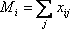. Суммарный объём промежуточного
 потребления в экономике:

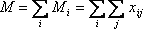

## II квадрант

Содержит информацию по использованию, конечном потреблении ВВП (ВВП
 в рыночных ценах). 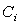 - потребление
 домашних хозяйств, 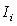 - валовые
 инвестиции,  - расходы правительства,
 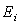 - чистый экспорт. Суммарное значение
 данных величин по отраслям даёт соответствующие величины для экономики
 в целом:

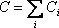, 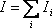, 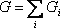, 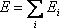

ВВП, рассчитанный по расходному методу, равен 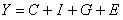.

Таким образом, вектор 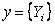,
 где 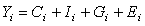, представляет собой вектор конечного
 потребления отраслей.

## III квадрант

В III квадранте представляется информация образования ВВП (ВВП в основных
 ценах). Для каждой j-ой отрасли доступна следующая информация:

	- 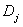. Амортизация;

	- . Заработная
	 плата и выплаты работникам;

	- 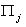. Прибыль;

	- 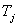. Налоги за
	 вычетом субсидий государства реальному сектору.

Сумма каждого из этих компонент даёт соответствующую величину по экономике
 в целом:

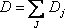, 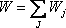, 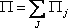,
 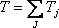

В свою очередь, сумма этих компонент даёт величину ВВП, рассчитанную
 по доходам: 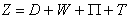.

Возможен расчет ВВП через добавленные стоимости по отраслям:

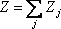

Таким образом, балансовое выражение для распределения продукции i-ой
 отрасли имеет вид:

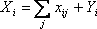

Балансовое выражение для потребления материалов, сырья и ресурсов j-ой
 отраслью имеет вид:

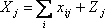

Суммируя первое выражение по i, а второе – по j, получаем:

То есть суммарный конечный выпуск равен суммарному условно чистому продукту.

## Матрица А

Для модели межотраслевого баланса постулируется прямопропорциональная
 зависимость между потреблением материалов, сырья 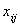
 отраслью j и её валовым выпуском 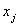. Данный
 коэффициент пропорциональности 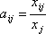
 называется коэффициентом прямых затрат и показывает необходимые затраты
 продукта отрасли i для производства единицы продукции отрасли j.

Матрица А – матрица коэффициентов прямых затрат 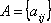.

Таким образом, выражение  может
 быть переписано в следующей форме: 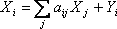.

Или в векторной форме: 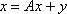

Где 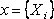 - вектор валовых выпусков по отраслям.

Таким образом, зная объёмы валового выпуска по отраслям x при заданной
 матрице прямых затрат А, можно найти значения конечного потребления y
 следующим образом: 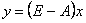.

где E – единичная матрица. Данная задача называется прямой.

В случае же, когда известны объёмы конечного потребления и необходимо
 найти отраслевые выпуски (обратная задача), применяется следующее выражение:
 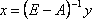.

См. также:

[Библиотека методов и моделей](../uimodelling_lib_common.htm)
 | Контейнер моделирования: модель «[Межотраслевой баланс](UiModelling.chm::/2_Container_of_Modeling/2_3_Work_object/2_3_2_Model/interindustry_balance/interindustry_balance.htm)»

		Справочная
		 система на версию 10.9
		 от 18/08/2025,
		 © ООО «ФОРСАЙТ»,
