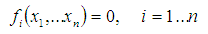
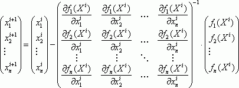
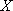
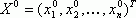
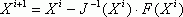
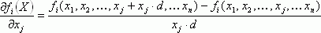
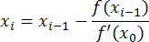

# Методы решения системы нелинейных уравнений

Методы решения системы нелинейных уравнений
-

# Методы решения системы нелинейных уравнений

Исходная система:

В качестве метода решения системы нелинейных уравнений можно выделить
 следующие методы:

	- Гибридный метод. Для
	 решения исходной системы используется модификация гибридного алгоритма,
	 реализованного в библиотеке математических методов MINPACK-1.

	- Минимум ошибок. Решается
	 задача нахождения минимума функции с n
	 числом переменных:

	- Метод Ньютона.
	 Решение исходной системы находится путем итераций с нахождением частных
	 производных:

Где:

		- начальное значение:

-
 

		- значение  для
		 новой итерации:

		- частная производная:

		- d. Относительное
		 приращение аргумента.

Итерации продолжаются пока не выполнено заданное
 число итераций или не достигнута требуемая точность решения.

	- Модифицированный метод простых
	 итераций. Задан набор начальных значений для каждой переменной.
	 На каждой итерации происходит подстановка значений данного набора
	 в каждое уравнение системы Fi(xi). Причем
	 значения в наборе, уже вычисленные на текущей итерации, будут подставлены
	 в обновленном виде:

Отличие от немодифицированного метода простых
 итераций в том, что входные значения на каждой итерации полностью берутся
 с предыдущей, т.е. уже вычисленные значения на текущей итерации не
 используются.

Итерации продолжаются пока отклонение полученных
 результатов от результатов с прошлой итерации по выбранной норме будет
 не больше заданного значения.

См. также:

[Библиотека методов и моделей](../uimodelling_lib_common.htm)
 | Контейнер моделирования: модель «[Система
 нелинейных уравнений](UiModelling.chm::/2_Container_of_Modeling/2_3_Work_object/2_3_2_Model/equations_set_Model/UiModelling_eq_set_Model_20.htm)» | [ISmNonLinearEquations](StatLib.chm::/Interface/ISmNonLinearEquations/ISmNonLinearEquations.htm)

		Справочная
		 система на версию 10.9
		 от 18/08/2025,
		 © ООО «ФОРСАЙТ»,
