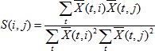
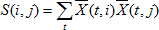
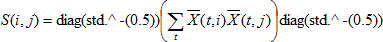
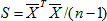
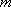
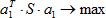
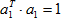
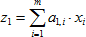
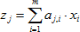
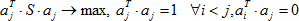

# Метод главных компонент

Метод главных компонент
-

# Метод главных компонент

Метод главных компонент (англ. *Principal component analysis, PCA*) - один из основных методов, используемых для уменьшения размерности данных с наименьшей потерей информации. Разработан К. Пирсоном (англ. *Karl Pearson*) в 1901 г. Применяется в распознавании образов, сжатии данных, компьютерном зрении и т. п. Вычисление главных компонент сводится к расчёту собственных векторов и собственных значений матрицы исходных данных. Также метод главных компонент известен как *преобразование Кархунена-Лоэва* (англ. *Karhunen-Loeve*) или преобразование Хотеллинга (англ. *Hotelling transform*).

Пусть Х(n x m) - матрица наблюдений за переменными x1, x2, …, xm и пусть S - матрица этих переменных. Варианты расчёта матрицы S в зависимости от её типа:

-
матрица корреляций:

-
стандартизованная матрица:

-
матрица сумм квадратов и перекрестных произведений:

-
матрица вариаций-ковариаций (используется в большинстве случаев):

Вектор a1 размерности  находится из условия:

При ограничении:

Переменная  называется первой главной компонентой, дает такую линейную комбинацию z1 переменных x1, x2, …, xm, которая максимизирует [дисперсию](../05_Statistics/UIModelling_dispers.htm).

Вторая и последующие главные компоненты:

Находится из условий:

В этом случае aj - собственные вектора матрицы S.

См. также:

[Библиотека методов и моделей](../uimodelling_lib_common.htm) | [ISmPrincipalComponentAnalysis](StatLib.chm::/Interface/ISmPrincipalComponentAnalysis/ISmPrincipalComponentAnalysis.htm)

		Справочная
		 система на версию 10.9
		 от 18/08/2025,
		 © ООО «ФОРСАЙТ»,
