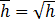
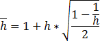
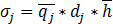
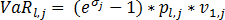
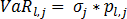
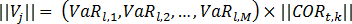
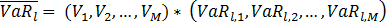

# Дельта-нормальный метод расчёта

Дельта-нормальный метод расчёта
-

# Дельта-нормальный метод расчёта

Метод используется для расчёта модели [VaR](UiModelling_ValueAtRisk.htm).

Расчёт проводится для каждой организации по каждому инструменту из портфеля организации.

Если используется гипотеза о случайном блуждании, то коэффициент горизонта рассчитывается по формуле: . Если гипотеза не используется:

Где h - коэффициент горизонта, h - значение параметра временного горизонта.

Далее считается квантиль q уровня 1 - α нормального распределения. Где α - значение уровня значимости (допустимые значения от 0 до 1).

Если гипотеза о нулевом среднем не используется, то вспомогательный параметр qj = q.

Если используется гипотеза о нулевом среднем, то при условии, что значение данного инструмента из портфеля отрицательное и различаются длинные и короткие позиции, то q считается по формуле: qj = q + bj. В других случаях формула имеет вид: qj = q - bj. Где bj - среднее значение j-го финансового инструмента.

Далее для каждого инструмента считается волатильность:

.

Где dj - стандартное отклонение по выборке j-го финансового инструмента.

Если используется логарифмическая доходность, то VaR рассчитывается по формуле:

.

Если логарифмическая доходность не используется:

.

Где:

-
pl,j. Количество j-го финансового инструмента из портфеля l-ой организации;

-
ν1,j. Стоимость j-го финансового инструмента на дату расчета.

Для каждой организации рассчитывается VaR портфеля. Для этого вектор VaR по финансовым инструментам каждой организации умножается на матрицу корреляций COR:

Полученный вектор скалярно умножается на вектор VaR по финансовым инструментам:

Из полученного числа извлекается квадратный корень:

Где VaRl является VaR портфеля l-ой организации.

Выходным параметром является матрица VaR = ǁVaRlǁ, содержащая VaR портфеля каждой организации, участвующей в расчете.

См. также:

[Value-At-Risk](UiModelling_ValueAtRisk.htm)

		Справочная
		 система на версию 10.9
		 от 18/08/2025,
		 © ООО «ФОРСАЙТ»,
