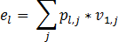
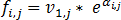
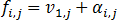
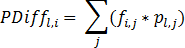
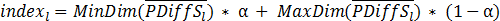

# Исторический метод расчёта

Исторический метод расчёта
-

# Исторический метод расчёта

Метод используется для расчёта модели [VaR](UiModelling_ValueAtRisk.htm).

Рассчитывается стоимость портфеля на текущую дату для каждой организации,
 участвующей в расчёте по формуле:

Где:

	- pl,j.
	 Количество j-го финансового
	 инструмента из портфеля l-ой
	 организации;

	- ν1,j. Стоимость j-го финансового инструмента на
	 дату расчета;

	- E = ǁelǁ. Вектор, содержащий стоимости
	 портфелей по всем финансовым инструментам, участвующим в расчете,
	 для каждой организации.

Формируется матрица цен финансовых инструментов с учетом вида доходности.
 Если используется логарифмическая доходность, то расчёт производится по
 формуле:

Если логарифмическая доходность не используется:

Где:

	- F = ǁfi,jǁ.
	 Матрица цен;

	- ν1,j. Стоимость j-го финансового инструмента на
	 дату расчета;

	- i
	 = 1, 2, … N.
	 Количество выделенных элементов в измерении даты (матрица финансовых
	 инструментов). i = 1 соответствует
	 самой младшей дате в периоде, N
	 соответствует расчетной дате.

Для каждой организации, участвующей в расчете, на каждую дату из матрицы
 доходности (начиная с даты h
 + 1) считается стоимость портфеля по всем финансовым инструментам:

Где:

	- pl,j.
	 Количество j-го финансового
	 инструмента из портфеля l-ой
	 организации;

	- fi,j. Цена j-го финансового инструмента на i-ую дату. i
	 = h+1, … , N.

Из матрицы PDiff для каждой
 организации формируется вектор из стоимостей, отсортированный по возрастанию.
 PDiffl - вектор
 стоимостей, отсортированный по возрастанию для l-ой
 организации.

Рассчитывается коэффициент для извлечения значения из вектора PDiffl по формуле:

Где

	- α. Значение уровня значимости
	 (допустимые значения от 0 до 1);

	- MinDim.
	 Значение минимальной границы в векторе;

	- MaxDim
	 - Значение максимальной границы в векторе.

Формула расчета VaR портфеля:

Где el
 - стоимость портфеля по всем финансовым инструментам, участвующим в расчете,
 для l-й организации.

Выходным параметром является матрица VaR = ǁVaRlǁ,
 содержащая VaR портфеля каждой
 организации, участвующей в расчете.

См. также:

[Value-At-Risk](UiModelling_ValueAtRisk.htm)

		Справочная
		 система на версию 10.9
		 от 18/08/2025,
		 © ООО «ФОРСАЙТ»,
