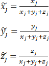
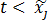

# Метод Монте-Карло

Метод Монте-Карло
-

# Метод Монте-Карло

Метод используется для расчёта модели [VaR](UiModelling_ValueAtRisk.htm).

Для каждого финансового инструмента, участвующего в расчете, выбирается
 распределение:

	- нормальное (гауссовское) распределение;

	- распределение Стьюдента;

	- распределение Хи-квадрат;

	- двустороннее экспоненциальное распределение;

	- распределение Вейбулла;

	- гамма-распределение;

	- равномерное распределение.

Финансовые инструменты могут иметь разные распределения.

В зависимости от распределения, генерируются коррелированные случайные
 величины по каждому финансовому инструменту. Матрица сгенерированных
 случайных величин:

R = ǁRk,jǁ

Где:

	- k. Количество испытаний;

	- j
	 = 1, 2, … M.
	 Количество финансовых инструментов, участвующих в расчете.

Формула расчета Rk,j зависит
 от вида распределения:

	- нормальное (гауссовское) распределение

Rk,j - псевдослучайное
 число, распределенное по нормальному закону со средним bj и стандартным
 отклонением dj.

	- распределение Стьюдента

Rk,j - t-значение [распределения
 Стьюдента](../05_Statistics/UiModelling_Student.htm) со случайной вероятностью (от 0 до 1) и степенью свободы
 равной 2.

	- распределение Хи-квадрат

Rk,j - псевдослучайное
 число, распределенное по закону Хи-квадрат со степенью свободы 1.

	- двустороннее экспоненциальное распределение

Для каждого финансового инструмента из матрицы
 доходности считаются:

	-

		- xj - количество элементов меньше нуля;

		- yj - количество элементов больше нуля;

		- zj - количество элементов равных нулю;

		- xj - среднее
		 по отрицательным элементам;

		- yj - среднее
		 по положительным элементам;

Если средние не учитываются, то zj всегда считается
 равным нулю.

Для генерации значений Rk,j считаются
 вспомогательные значения:

Для каждого k
 генерируется случайное число t
 от 0 до 1.

Если , то
 Rk,j
 - экспоненциальное распределение с интенсивностью .

Если , то
 Rk,j
 равняется нулю, иначе Rk,j экспоненциальное
 распределение с интенсивностью .

	- распределение Вейбулла

Rk,j - псевдослучайное
 число, распределенное по закону Вейбулла с параметрами dj и bj,
 а именно, значение , где p - это псевдослучайное число,
 равномерно распределенное на промежутке от 0 до 1.

	- гамма-распределение

Rk,j - обратное
 гамма распределение со случайной вероятностью p
 (от 0 до 1).

	- равномерное распределение

Rk,j - случайное
 число, равномерно распределенное между началом промежутка dj (включая
 его) и концом промежутка dj (исключая
 его).

 - средние значения финансовых инструментов.

 - стандартные отклонения по выборке
 финансовых инструментов.

Если используется факторизация Холецкого, то из матрицы корреляций COR формируется матрица Холецкого
 - H. Каждая строка матрицы R умножается на матрицу Холецкого
 по правилам умножения вектора-строки на матрицу. Полученный вектор заменяет
 строку матрицы R.

Расчёт VaR производится историческим
 методом, но вместо матрицы доходности используется сгенерированная матрица
 R.

Выходным параметром является матрица VaR = ǁVaRlǁ,
 содержащая VaR портфеля каждой
 организации, участвующей в расчете.

См. также:

[Value-At-Risk](UiModelling_ValueAtRisk.htm)

		Справочная
		 система на версию 10.9
		 от 18/08/2025,
		 © ООО «ФОРСАЙТ»,
