# Value-At-Risk

Value-At-Risk
-

# Value-At-Risk

Value-At-Risk (рисковая стоимость)
 - одна из самых распространенных форм измерения финансовых рисков. Общепринято
 обозначается «VaR». Этот показатель характеризует величину возможного
 убытка с выбранной вероятностью за определенный промежуток времени.

Сутью VaR является четкий и
 однозначный ответ на вопрос: какой максимальный убыток рискует понести
 инвестор за определенный период времени с заданной вероятностью? Отсюда
 следует, что величина VaR определяется
 как наибольший ожидаемый убыток, который с заданной вероятностью может
 получить инвестор в течение n
 дней.

Ключевыми параметрами VaR является
 период времени, на который производится расчет риска, и заданная вероятность
 того, что потери не превысят определенной величины. Например, стандартом
 для брокерско-дилерских отчетов по операциям с внебиржевыми производными
 инструментами, передаваемым в Комиссию по биржам и ценным бумагам США,
 являются 2-недельный период и 99%-вероятность. The Bank of International
 Settlements для оценки достаточности банковского капитала установил вероятность
 на уровне 99% и период, равный 10 дням. JP Morgan опубликовывает свои
 дневные значения VaR при 95% доверительном уровне.

VaR является универсальной методикой
 расчета различных видов риска:

	- ценового риска. Риск
	 изменения стоимости цены финансового актива на рынке;

	- валютного риска. Риск,
	 связанный с изменением рыночного валютного курса национальной валюты
	 к валюте другой страны;

	- кредитного риска. Риск,
	 возникающий при частичной или полной неплатежеспособности заемщика
	 по взятому кредиту;

	- риска ликвидности. Риск,
	 связанный с невозможностью продажи финансового актива, либо с большими
	 убытками, возникающими при продаже актива в силу большой разницы величины
	 покупки/продажи, существующей на рынке.

При расчете на вход подаются две матрицы:

	- матрица с финансовыми инструментами.
	 Состоит из измерений:

	-

		- дата. Включает дату расчета и даты, входящие в период ретроспективы.
		 Измерение не должно содержать пропусков, начиная от расчетной
		 даты и заканчивая последней датой из ретроспективы;

		- финансовые инструменты;

		- значение.

	- портфель - матрица,
	 содержащая список организаций и количество финансовых инструментов,
	 которые имеются у организаций. Состоит из измерений:

	-

		- организации;

		- финансовые инструменты;

		- значение.

Перед расчетом VaR необходимо
 рассчитать следующие величины:

	- доходность;

	- матрицу корреляций;

	- средние значения;

	- стандартные отклонения по выборке.

Если используется заполнение пропусков, то производится проверка матрицы
 финансовых инструментов на наличие пустых значений (Null). Проверка проводится
 с первой даты ретроспективы до расчетной даты по каждому финансовому инструменту.
 Если встречается значение Null, то вместо него устанавливается первое
 непустое значение за предыдущую дату, входящую в период ретроспективы,
 если за предыдущие периоды все значения являются пустыми, то значение
 остается пустым.

Для каждого финансового инструмента производится расчет доходности на
 расчетную дату и на весь период ретроспективы, начиная с даты после первой
 даты в периоде, через количество дней, указанных в качестве временного
 горизонта. Если используется логарифмическая доходность, то расчет производится
 по формуле:

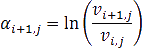

Если логарифмическая доходность не используется, то по формуле:

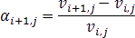

Где:

	- 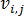. Стоимость j-го
	 финансового инструмента на i
	 дату;

	- i = h, h+1, … N. Дата в расчетном периоде:

		- i = 1. Самая младшая
		 дата в периоде;

		- i = h
		 + 1. Дата, наступающая через h
		 дней после первой даты в периоде;

		- N. Расчетная дата;

		- h. Значение временного
		 горизонта;

	- j = 1, 2, … M.
	 Количество выделенных элементов в измерении финансовых инструментов
	 (матрица финансовых инструментов).

Для всех финансовых инструментов: 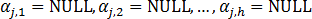

На основе полученной матрицы доходности считается матрица корреляций.
 Если не используется гипотеза о нулевом среднем, то считается среднее
 значение за весь период отмеченных дат для каждого финансового инструмента
 (пустые значения не учитываются):

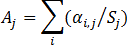

Где:

	- ai,j. Доходность j-го финансового инструмента на
	 i дату;

	- Sj.
	 Количество непустых значений доходности для j-го
	 финансового инструмента;

	- Aj.
	 Среднее значение за весь период отмеченных дат для j-го
	 финансового инструмента.

Далее из каждой строки матрицы доходности вычитается вектор средних
 значений, по правилам вычитания матриц:

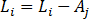

Где Li -
 строка из матрицы доходностей:

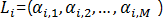

Матрица доходностей:

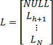

Для расчета матрицы корреляций считается матрица ковариаций по формуле:

Где:

	- λ = 0.9;

	- C. Матрица ковариаций.

Матрица корреляции считается по формуле:

Где:

	- t, k. Размер матрицы ковариаций;

	- 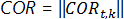. Матрица корреляций.

Для каждого финансового инструмента рассчитывается среднее значение
 (пустые значения не учитываются) и стандартное отклонение по выборке.
 Источником данных является матрица доходности.

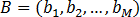. Средние значения финансовых инструментов.

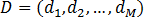. Стандартные отклонения по выборке финансовых
 инструментов.

M. Количество выделенных элементов
 в измерении финансовые инструменты матрицы финансовых инструментов.

Формула расчета стандартного отклонения по выборке:

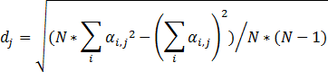

Где i = 1, 2, … N
 - количество выделенных элементов в измерении даты (матрица финансовых
 инструментов). i = 1 соответствует
 самой младшей дате в периоде, N
 соответствует расчетной дате.

Расчет VaR производится тремя
 методами:

	- [дельта-нормальный](UiModelling_ValueAtRisk.DeltaNormal.htm);

	- [исторический](UiModelling_ValueAtRisk.Historic.htm);

	- [метод Монте-Карло](UiModelling_ValueAtRisk.MonteCarlo.htm).

См. также:

[Библиотека методов и моделей](../uimodelling_lib_common.htm)
 | [Бэктестинг: «Принцип
 светофора»](UiModelling_ValueAtRisk.Backtesting.htm) | Контейнер моделирования: модель «[Value-At-Risk](UiModelling.chm::/2_Container_of_Modeling/2_3_Work_object/2_3_2_Model/Value-At-Risk/UiModelling_ValueAtRisk_Main.htm)»

		Справочная
		 система на версию 10.9
		 от 18/08/2025,
		 © ООО «ФОРСАЙТ»,
