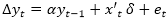
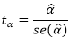
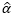
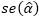

# Расширенный тест Дики-Фуллера

Расширенный тест Дики-Фуллера
-

# Расширенный тест Дики-Фуллера

Расширенный тест Дики-Фуллера (англ. Augment Dickey-Fuller Test) основывается на регрессии вида:

Где α = ρ-1.

Нулевую и альтернативную гипотезы можно записать следующим образом:

H0: α = 0;

H1: α < 0.

Тест опирается на t - статистику:

Где:

-
 - оценка коэффициента α;

-
 - стандартная ошибка коэффициента.

Выводы о принятии той или иной гипотезы делаются на основе одностороннего распределения МакКиннона.

См. также:

[Библиотека методов и моделей](../uimodelling_lib_common.htm) | [Тесты на единичные корни](UnitRootTests.htm) | [ISmAugmentDickeyFullerTest](StatLib.chm::/Interface/ISmAugmentDickeyFullerTest/ISmAugmentDickeyFullerTest.htm)

		Справочная
		 система на версию 10.9
		 от 18/08/2025,
		 © ООО «ФОРСАЙТ»,
