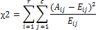

# Хи-тест

Хи-тест
-

# Хи-тест

Хи-тест вычисляет критерий независимости: значение распределения χ2 (хи-квадрат) для статистического распределения и соответствующего числа степеней свободы.

Критерий χ2 сначала вычисляет статистику χ2 по формуле:

,

где

-
Aij. Фактическая частота в i-й строке, j-м столбце;

-
Eij. Ожидаемая частота в i-й строке, j-м столбце;

-
r. Число строк;

-
c. Число столбцов.

Нижнее значение критерия χ2 является признаком независимости. Как видно из формулы, критерий χ2 всегда положительный или равен 0, а последнее возможно только в том случае, если Aij = Eij при любых значениях i, j.

Хи-тест возвращает вероятность того, что при условии независимости может быть получено такое значение статистики χ2, которое будет по крайней мере не меньше значения, рассчитанного по приведенной выше формуле. Для вычисления этой вероятности Хи-тест использует распределение χ2 с соответствующим числом степеней свободы (df). Если r > 1, а c > 1, то df = (r - 1)(c - 1). Если r = 1, а c > 1, то df = c - 1; если же r > 1, а c = 1, то df = r - 1. Равенство, где r = c = 1, недопустимо.

Использовать Хи-тест лучше всего при не слишком малых значениях Eij. Некоторые специалисты по статистике полагают, что значение Eij должно быть больше или равно 5.

См. также:

[Библиотека методов и моделей](../uimodelling_lib_common.htm) | [IStatistics.ChiTest](StatLib.chm::/Interface/IStatistics/IStatistics.ChiTest.htm)

		Справочная
		 система на версию 10.9
		 от 18/08/2025,
		 © ООО «ФОРСАЙТ»,
