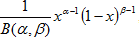
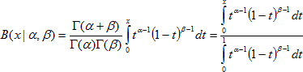
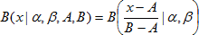
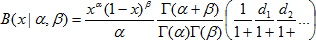
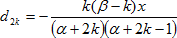
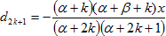
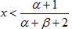
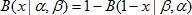

# Функция бета-распределения вероятности

Функция бета-распределения вероятности
-

# Функция бета-распределения вероятности

Плотность бета-распределения с параметрами α, β в точке x определяется выражением:

Где полная бета-функция:

Таким образом, значение интегральной функции бета-распределения:

Если распределение определено не на стандартном отрезке [0, 1] (область значений случайной величины), а на произвольном отрезке [A, B] общая функция распределения приводится к стандартной простым масштабированием и будет иметь вид:

## Обратная функция бета-распределения вероятности

Для вычисления значения интегральной функции бета-распределения применяется ее разложение в цепную дробь:

Где:

Рассматривается последовательность четных подходящих дробей, демонстрирующую достаточно хорошую сходимость при условии:

В противном случае:

.

См. также:

[IStatistics.BetaDist](StatLib.chm::/Interface/IStatistics/IStatistics.BetaDist.htm) | [IStatistics.BetaInv](StatLib.chm::/Interface/IStatistics/IStatistics.BetaInv.htm) | [Библиотека методов и моделей](../../uimodelling_lib_common.htm)

		Справочная
		 система на версию 10.9
		 от 18/08/2025,
		 © ООО «ФОРСАЙТ»,
