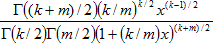
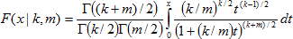

# Функция F-распределения вероятности

Функция F-распределения вероятности
-

# Функция F-распределения вероятности

Плотность распределения Фишера со степенями свободы k, m в точке x определяется выражением:

## Обратная функция F-распределения вероятности

Значение интегральной функции распределения Фишера:

На практике для вычисления значения функции распределения Фишера используется её связь с [бета-распределением](../Distribution/Lib_BetaDistribution.htm):

См. также:

[IStatistics.FDist](StatLib.chm::/Interface/IStatistics/IStatistics.FDist.htm) | [IStatistics.FInv](StatLib.chm::/Interface/IStatistics/IStatistics.FInv.htm) | [Библиотека методов и моделей](../../uimodelling_lib_common.htm)

		Справочная
		 система на версию 10.9
		 от 18/08/2025,
		 © ООО «ФОРСАЙТ»,
