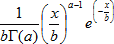
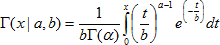
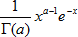
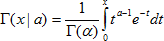

# Функция гамма-распределения вероятности

Функция гамма-распределения вероятности
-

# Функция гамма-распределения вероятности

Плотность гамма-распределения с параметрами a, b в точке x определяется выражением:

Таким образом, значение интегральной функции гамма-распределения:

Параметр b является параметром масштаба. В стандартном случае b = 1 плотность гамма-распределения определяется выражением:

## Обратная функция гамма-распределения вероятности

Интегральная функция гамма-распределения:

См. также:

[IStatistics.GammaDist](StatLib.chm::/Interface/IStatistics/IStatistics.GammaDist.htm) | [IStatistics.GammaInv](StatLib.chm::/Interface/IStatistics/IStatistics.GammaInv.htm) | [Библиотека методов и моделей](../../uimodelling_lib_common.htm)

		Справочная
		 система на версию 10.9
		 от 18/08/2025,
		 © ООО «ФОРСАЙТ»,
