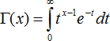
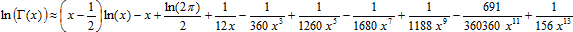

# Значение Гамма-функции

Значение Гамма-функции
-

# Значение Гамма-функции

Г(x) – гамма-функция:

## Натуральный логарифм Гамма-функции

При x ≥ 12 натуральный логарифм Гамма-функции вычисляется посредством частичной суммы ряда:

При x ϵ (0, 12) вычисление функции предварительно сводится к случаю x > 12 посредством последовательного применения правила Г(x) = Г(x + 1)/x или ln(Г(x)) =ln(Г(x + 1)) - ln(x).

См. также:

[IStatistics.GammaFunc](StatLib.chm::/Interface/IStatistics/IStatistics.GammaFunc.htm) | [IStatistics.GammaLn](StatLib.chm::/Interface/IStatistics/IStatistics.GammaLn.htm) | [Библиотека методов и моделей](../../uimodelling_lib_common.htm)

		Справочная
		 система на версию 10.9
		 от 18/08/2025,
		 © ООО «ФОРСАЙТ»,
