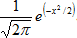
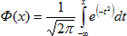
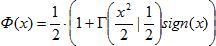

# Функция стандартного нормального распределения вероятности

Функция стандартного нормального распределения вероятности
-

# Функция стандартного нормального распределения вероятности

Стандартное нормальное распределение имеет среднее, равное нулю, и стандартное отклонение, равное единице. Плотность стандартного нормального распределения в точке x определяется выражением:

Таким образом, значение интегральной функции нормального распределения:

Для вычисления значения функции стандартного нормального распределения используется его связь с [гамма-распределением](../Distribution/Lib_GammaDistribution.htm):

См. также:

[IStatistics.NormsDist](StatLib.chm::/Interface/IStatistics/IStatistics.NormsDist.htm) | [IStatistics.NormsInv](StatLib.chm::/Interface/IStatistics/IStatistics.NormsInv.htm) | [Библиотека методов и моделей](../../uimodelling_lib_common.htm)

		Справочная
		 система на версию 10.9
		 от 18/08/2025,
		 © ООО «ФОРСАЙТ»,
