# Обобщенное распределение экстремальных значений

Обобщенное распределение экстремальных значений
-

# Обобщенное распределение экстремальных значений

В теории вероятности и математической статистике распределение экстремальных
 значений (EV) представляет собой семейство вероятностных распределений,
 разработанных для теории экстремальных значений. Обобщенное распределение
 экстремальных значений представляет собой обобщение распределений Гумбельта,
 Фрешета и [Вейбулла](Lib_WeibullDistribution.htm) и используется
 для приближенного моделирования максимумов конечных последовательностей
 случайных величин.

Пусть случайная величина X
 распределена по закону, который описан функцией:

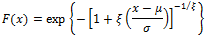

Где:

	- ξ > 0.
	 Параметр формы;

	- 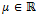.
	 Параметр размещения;

	- 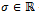.
	 Параметр масштаба.

Тогда случайная величина X
 имеет обобщенное распределение экстремальных значений или 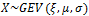.

Функция плотности распределения:

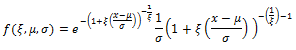

## Характеристики распределения

	- Математическое ожидание:

Где γ
 - константа Эйлера;

	- Дисперсия:

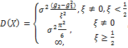

Где 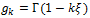 - гамма
 функция;

	- Мода:

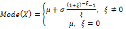

	- Медиана:

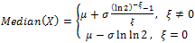

	- Коэффициент эксцесса:

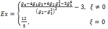

## Оценка параметров распределения

	- [Оценка методом максимального
	 правдоподобия](MaximumLikelihood.htm)

Логарифмическая функция правдоподобия для
 GEV распределения при ξ ≠ 0:

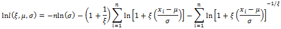

Логарифмическая функция правдоподобия для
 GEV распределения при ξ = 0:

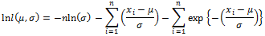

Для поиска оптимальной оценки параметров
 необходимо максимизировать обе функции правдоподобия и выбрать максимальный
 результат. Это и будет наилучшей оценкой параметров.

	- [Оценка
	 методом линейной комбинации показателей расстояний](Linear_Combination_of_Ratios_of_Spacings.htm).

См. также:

[Библиотека методов и моделей](../../uimodelling_lib_common.htm)
 | [ISmGeneralizedExtremeValueDistribution](StatLib.chm::/Interface/ISmGeneralizedExtremeValueDistribution/ISmGeneralizedExtremeValueDistribution.htm)

		Справочная
		 система на версию 10.9
		 от 18/08/2025,
		 © ООО «ФОРСАЙТ»,
