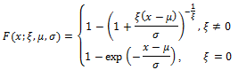
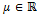
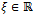
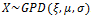
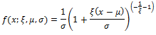
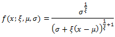
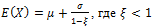
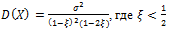
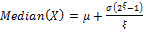
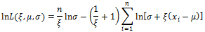

# Обобщенное распределение Парето

Обобщенное распределение Парето
-

# Обобщенное распределение Парето

В статистике обобщенное распределение Парето (GPD) представляет собой
 семейство непрерывных вероятностных распределений. Оно часто используется
 для моделирования хвостов других распределений.

Пусть случайная величина X
 распределена по закону, который описан функцией:

Для x ≥ μ
 при ξ ≥ 0 и μ ≤ x ≤ μ - σ / ξ
 при ξ < 0, где:

	- .
	 Параметр размещения;

	- σ > 0.
	 Параметр масштаба;

	- .
	 Параметр формы.

Тогда случайная величина X имеет обобщенное распределение Парето или
 .

Функция плотности распределения:

Или

Если μ ≤ x ≤ μ - σ / ξ при ξ < 0.

## Характеристики распределения

	- Математическое ожидание:

	- Дисперсия:

	- Медиана:

Обобщенное распределение Парето не имеет коэффициентов асимметрии и
 эксцесса.

## Оценка параметров распределения

	- [Оценка методом максимального
	 правдоподобия](MaximumLikelihood.htm)

Логарифмическая функция правдоподобия для
 GРD распределения:

Для x ≥ μ при ξ ≥ 0
 и μ ≤ x ≤ μ - σ / ξ при ξ < 0.

Для поиска оптимальной оценки параметров
 необходимо максимизировать ln L(ξ, μ, σ).

См. также:

[Библиотека методов и моделей](../../uimodelling_lib_common.htm)
 | [ISmGeneralizedParetoDistribution](StatLib.chm::/Interface/ISmGeneralizedParetoDistribution/ISmGeneralizedParetoDistribution.htm)

		Справочная
		 система на версию 10.9
		 от 18/08/2025,
		 © ООО «ФОРСАЙТ»,
