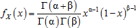

# Бета-распределение

Бета-распределение
-

# Бета-распределение

Бета-распределение с параметрами α, β > 0 при x ϵ [0, 1] характеризуется функцией плотности вероятности:

Где Г - гамма-функция, имеющая вид:

Используется общий метод генерирования случайных величин с распределением X ~ B(α, β) для любых значений α > 0 и β > 0, основывающийся на том факте, что если две независимые случайные величины подчиняются гамма-распределению Y1 ~ Г(α, 1), Y2 ~ Г(β, 1), то величина Y1 / (Y1 + Y2) ~ B(α, β) имеет бета-распределение. Алгоритм включает следующие операции:

1. Независимо генерируются две псевдослучайные выборки из [гамма-распределения](Lib_GammaDistribution.htm) Y1 ~ Г(α, 1), Y2 ~ Г(β, 1).

2. Вычисляется значение X = Y1 / (Y1 + Y2).

См. также:

[ISmBetaDistribution](StatLib.chm::/Interface/ISmBetaDistribution/ISmBetaDistribution.htm) | [Библиотека методов и моделей](../../uimodelling_lib_common.htm)

		Справочная
		 система на версию 10.9
		 от 18/08/2025,
		 © ООО «ФОРСАЙТ»,
