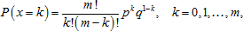
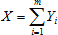

# Биномиальное распределение

Биномиальное распределение
-

# Биномиальное распределение

Биномиальное распределение - это распределение числа успехов в серии из n экспериментов, каждый из которых завершается успехом с вероятностью p. Важными предельными случаями биномиального распределения являются [распределение Пуассона](Lib_PoissonDistribution.htm) и [нормальное распределение](Lib_NormalDistribution.htm).

Функция плотности вероятности задаётся формулой:

Где:

-
m. Количество независимых испытаний, m > 0;

-
p. Вероятность «успеха» в каждом испытании, 0 ≤ p ≤ 1;

-
x. Число «успехов».

Если для моделирования случайных величин в функции использован тот факт, что если Y1, …, Ym - независимые случайные величины, имеющие распределение Бернулли с вероятностью успеха p, то величина  имеет биномиальное распределение с m степенями свободы. Таким образом, для генерирования псевдослучайной величины X ~ Bin(m, p) выполняются следующие операции:

1. Генерирование выборки для m независимых случайных величин Y1, …, Ym , одинаково распределенных по закону Бернулли с вероятностью успеха p в каждом испытании. Для моделирования случайной величины с распределением Бернулли Y генерируется выборка U = {u1, …, un} из непрерывного равномерного распределения на отрезке (0, 1), после чего присваиваются значения величинам Y = {y1, …, yn} по следующему правилу:

yi = 0, если 0 ≤ ui ≤ 1

yi = 1, если p < ui ≤ 1

2. Значения элементов выборки X из заданного биномиального распределения получаются по следующему правилу:

X = Y1 + Y2 + … + Ym

или xi = y1,i + y2,i + … + ym,i

См. также:

[ISmBinomialDistribution](StatLib.chm::/Interface/ISmBinomialDistribution/ISmBinomialDistribution.htm) | [IStatistics.BinomDist](StatLib.chm::/Interface/IStatistics/IStatistics.BinomDist.htm) | [Библиотека методов и моделей](../../uimodelling_lib_common.htm)

		Справочная
		 система на версию 10.9
		 от 18/08/2025,
		 © ООО «ФОРСАЙТ»,
