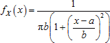
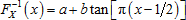

# Распределение Коши

Распределение Коши
-

# Распределение Коши

Распределение Коши C(a, b)
 с параметрами сдвига a и масштаба b > 0
 характеризуется функцией плотности вероятности:

Для моделирования случайных величин в функции используется метод обратного
 преобразования, позволяющий при наличии генератора выборки из стандартного
 непрерывного равномерного распределения получить искомую выборку при помощи
 обратной функции распределения Коши:

Таким образом, для генерирования псевдослучайной величины X ~ С(a, b) выполняются следующие операции:

	- Генерирование выборки u1, …, un
	 псевдослучайных чисел из стандартного непрерывного равномерного распределения
	 на интервале (0, 1).

	- На основании обратной функции  вычисляется
	 выборка из заданного распределения Коши по формуле:

См. также:

[ISmCauchyDistribution](StatLib.chm::/Interface/ISmCauchyDistribution/ISmCauchyDistribution.htm)
 | [Библиотека
 методов и моделей](../../uimodelling_lib_common.htm)

		Справочная
		 система на версию 10.9
		 от 18/08/2025,
		 © ООО «ФОРСАЙТ»,
