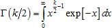

# Распределение хи-квадрат

Распределение хи-квадрат
-

# Распределение хи-квадрат

Распределение χ2 (хи-квадрат) с k степенями свободы характеризуется функцией плотности вероятности:

Где Г - гамма-функция, имеющая вид:

Поскольку распределение хи-квадрат χ2(k) является частным случаем [гамма-распределения](Lib_GammaDistribution.htm) Г(k/2, 2) с параметром формы k/2 и параметром масштаба 2, то используется генерирование случайных величин из указанного гамма-распределения.

См. также:

[ISmChi2Distribution](StatLib.chm::/Interface/ISmChi2Distribution/ISmChi2Distribution.htm) | [IStatistics.ChiDist](StatLib.chm::/Interface/IStatistics/IStatistics.ChiDist.htm) | [IStatistics.ChiInv](StatLib.chm::/Interface/IStatistics/IStatistics.ChiInv.htm) | [IStatistics.ChiTest](StatLib.chm::/Interface/IStatistics/IStatistics.ChiTest.htm) | [Библиотека методов и моделей](../../uimodelling_lib_common.htm)

		Справочная
		 система на версию 10.9
		 от 18/08/2025,
		 © ООО «ФОРСАЙТ»,
