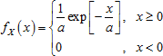
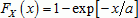
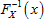
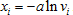

# Экспоненциальное распределение

Экспоненциальное распределение
-

# Экспоненциальное распределение

Экспоненциальное распределение с математическим ожиданием a > 0 характеризуется функцией плотности вероятности:

Для моделирования случайных величин использован метод обратного преобразования, позволяющий при наличии генератора выборки из стандартного непрерывного равномерного распределения получить выборку из экспоненциального распределения, задаваемого функцией:

Генерирование выборки x1, …, xn псевдослучайных чисел, подчиняющихся экспоненциальному распределению с заданным параметром λ, производится путём выполнения следующих операций:

1. Генерирование выборки v1, …, vn псевдослучайных чисел из стандартного непрерывного равномерного распределения на интервале (0, 1).

2. На основании обратной функции  вычисляется искомая выборка из заданного экспоненциального распределения по формуле: .

См. также:

[ISmExponentialDistribution](StatLib.chm::/Interface/ISmExponentialDistribution/ISmExponentialDistribution.htm) | [IStatistics.ExponDist](StatLib.chm::/Interface/IStatistics/IStatistics.ExponDist.htm) | [Библиотека методов и моделей](../../uimodelling_lib_common.htm)

		Справочная
		 система на версию 10.9
		 от 18/08/2025,
		 © ООО «ФОРСАЙТ»,
