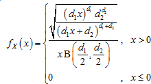
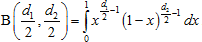
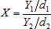

# Распределение Фишера

Распределение Фишера
-

# Распределение Фишера

Распределение Фишера с количеством степеней свободы d1 и d2 характеризуется функцией плотности вероятности:

Где B - бета-функция, имеющая вид:

Если две независимые случайные величины описываются χ2-распределением Y1 ~ χ2(d1) и Y2 ~ χ2(d2), то случайная величина

имеет распределение Фишера со степенями свободы (d 1, d 2). Поскольку распределение χ 2 (d i ) является частным случаем [гамма-распределения](Lib_GammaDistribution.htm) , то совпадает с Г (d i/2, 2). Выполняются следующие операции:

1. При помощи [гамма-распределения](Lib_GammaDistribution.htm) генерируются две независимых псевдослучайных величины Y1 ~ Г(d1/2, 2) и Y2 ~ Г(d2/2, 2).

2. Вычисляются значения элементов искомой выборки:

См. также:

[ISmFisherDistribution](StatLib.chm::/Interface/ISmFisherDistribution/ISmFisherDistribution.htm) | [Библиотека методов и моделей](../../uimodelling_lib_common.htm)

		Справочная
		 система на версию 10.9
		 от 18/08/2025,
		 © ООО «ФОРСАЙТ»,
