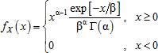
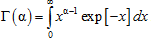
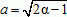

# Гамма-распределение

Гамма-распределение
-

# Гамма-распределение

Гамма-распределение с параметрами α, β > 0 характеризуется функцией
 плотности вероятности:

Где функция Γ(α) имеет вид:

При моделировании случайных величин X ~ Г(α, β)
 учитывается свойство масштабирования гамма-распределения по параметру
 β. При этом сначала создается модель X1 ~ Г(α, 1)
 для β = 1, а переход к гамма-величине с другими значениями параметра
 β выполняется путём умножения X = β·X1.

Для генерирования величин из распределения Г(α, 1) используется
 три алгоритма, каждый из которых действителен в своей области значений
 α:

	- 0 < α < 1.
	 Применяется алгоритм Аренса и Дитера (Ahrens and Dieter, 1974), в
	 рамках которого для генерирования каждой гамма-величины реализуются
	 следующие операции:

		- Генерируется число из стандартного равномерного распределения
		 u1 ~ U(0, 1), а также вычисляются
		 значения b = (exp + α) / exp,
		 а также P = b·u1. Если
		 P > 1, выполняется
		 переход к шагу 3. В противном случае - переход к шагу 2.

		- Допускаем Y = P1/α,
		 затем генерируется число u2 ~ U(0, 1). Если u2 ≤ exp[Y], то возвращается значение
		 X = Y.
		 В противном случае происходит возврат к шагу 1.

		- Допускаем Y = –ln [(b – P)/α],
		 затем генерируется число u2 ~ U(0, 1). Если u2 ≤ Yα – 1,
		 то возвращается значение X = Y. В противном случае происходит
		 возврат к шагу 1.

	- α = 1. Выполняется
	 алгоритм, основанный на том свойстве, что распределение Г(1, 1)
	 является [экспоненциальным
	 распределением](Lib_ExponentialDistribution.htm) со средним значением 1. В этом случае псевдослучайная
	 величина X ~ Г(1, 1)
	 генерируется при помощи метода обратного преобразования, т.е. на основании
	 обратной функции экспоненциального распределения вычисляется выборка:
	 X = –ln U, где U ~ U(0, 1) – случайная величина,
	 равномерно распределенная на интервале (0, 1).

	- α > 1. Выполняется
	 алгоритм Ченга (Cheng, 1977), модифицированный Лоу и Кельтоном, в
	 рамках которого для генерирования каждой гамма-величины реализуются
	 следующие операции:

		- Вычисляются значения констант: , b = α – ln 4,
		 q = α + 1/α,
		 Q = 4.5 и d = 1 + ln Q.

		- Генерируется два независимых числа u1 и u2
		 из стандартного равномерного распределения U(0, 1).

		- Допускаем V = a ln [U1/(1 – U1)],
		 Y = α exp[V], Z = U12 U2
		 и W = b + qV – Y.

		- Если W + d – QZ ≥ 0,
		 возвращается X = Y. В противном случае происходит
		 переход к шагу 5.

		- Если W ≥ ln Z, возвращается X = Y. В противном
		 случае - переход к шагу 2.

См. также:

[ISmGammaDistribution](StatLib.chm::/Interface/ISmGammaDistribution/ISmGammaDistribution.htm) |
 [Библиотека
 методов и моделей](../../uimodelling_lib_common.htm)

		Справочная
		 система на версию 10.9
		 от 18/08/2025,
		 © ООО «ФОРСАЙТ»,
