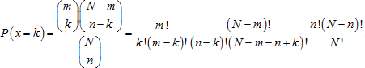
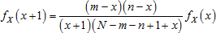
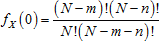
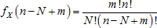
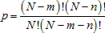
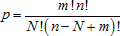
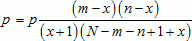

# Гипергеометрическое распределение

Гипергеометрическое распределение
-

# Гипергеометрическое распределение

Гипергеометрическое распределение позволяет моделировать количество
 успехов при выборке из конечной совокупности без возвращения. В общем,
 если случайная величина X соответствует
 гипергеометрическому распределению, то вероятность получения ровно k успехов в выборке, содержащей
 n элементов, определяется формулой:

	- если k = max(0, m + n – N) ,… , min(n, m),
	 то

	- иначе P(x = k) = 0

Где:

	- N.
	 Объем всей совокупности;

	- n.
	 Объем одной выборки;

	- m.
	 Количество «успешных» элементов во всей совокупности N;

Для генерирования случайных чисел применяется алгоритм (описанный Fishman,
 1978), основанный на методе обратного преобразования. В основе алгоритма
 лежит рекурсивная формула:

Начинающаяся с:

	- при n < N - m:

	- при n < N - m:

Таким образом, для генерирования выборки из гипергеометрического распределения
 алгоритм, включающий следующие операции:

	- Если n < N - m,
	 то принимается:

xi = 0

В противном случае:

xi = n – N
 + m

	- Генерируется псевдослучайное число ui ~ U(0, 1) из непрерывного равномерного
	 распределения на отрезке (0, 1), при этом i = 1 … ns.

	- Если ui ≤ p,
	 то возвращается значение xi. Иначе повторяется
	 выполнение следующих трех действий до тех пор, пока не выполнится
	 условие ui ≤ p:

xi = xi + 1

ui = ui – p

после чего также возвращается значение xi.

Операции 2 и 3 выполняются ns
 раз, каждое возвращенное значение x
 представляет один элемент искомой выборки.

См. также:

[ISmHyperGeometricDistribution](StatLib.chm::/Interface/ISmHyperGeometricDistribution/ISmHyperGeometricDistribution.htm)
 | [IStatistics.HypGeomDist](StatLib.chm::/Interface/IStatistics/IStatistics.HypGeomDist.htm)
 | [Библиотека
 методов и моделей](../../uimodelling_lib_common.htm)

		Справочная
		 система на версию 10.9
		 от 18/08/2025,
		 © ООО «ФОРСАЙТ»,
