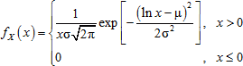

# Логнормальное распределение

Логнормальное распределение
-

# Логнормальное распределение

Логнормальное распределение характеризуется функцией плотности вероятности:

При этом величина Y = ln X имеет нормальное распределение с математическим ожиданием μ и дисперсией σ2.

Функция вычисляет значения exp[Y], при этом выборка псевдослучайных чисел y1, …, yn из нормального распределения с математическим ожиданием μ и дисперсией σ2 генерируется при помощи метода Бокса-Мюллера (см. описание [нормального распределения](Lib_NormalDistribution.htm)).

См. также:

[ISmLogNormalDistribution](StatLib.chm::/Interface/ISmLogNormalDistribution/ISmLogNormalDistribution.htm) | [IStatistics.LogNormDist](StatLib.chm::/Interface/IStatistics/IStatistics.LogNormDist.htm) | [Библиотека методов и моделей](../../uimodelling_lib_common.htm)

		Справочная
		 система на версию 10.9
		 от 18/08/2025,
		 © ООО «ФОРСАЙТ»,
