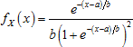
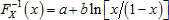
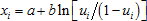

# Логистическое распределение

Логистическое распределение
-

# Логистическое распределение

Логистическое распределение с параметрами сдвига a
 и масштаба b > 0
 характеризуется функцией плотности вероятности:

Для моделирования случайных величин применяется метод обратного преобразования,
 позволяющий при наличии генератора выборки из стандартного непрерывного
 равномерного распределения получить искомую выборку при помощи обратной
 функции логистического распределения:

Таким образом, для генерирования псевдослучайной величины X
 из логистического распределения выполняются следующие операции:

	- Генерирование выборки u1, …, un
	 псевдослучайных чисел из стандартного непрерывного равномерного распределения
	 на интервале (0, 1).

	- На основании обратной функции  вычисляется
	 выборка из заданного логистического распределения по формуле:

См. также:

[ISmLogisticDistribution](StatLib.chm::/Interface/ISmLogisticDistribution/ISmLogisticDistribution.htm)
 | [Библиотека методов и моделей](../../uimodelling_lib_common.htm)

		Справочная
		 система на версию 10.9
		 от 18/08/2025,
		 © ООО «ФОРСАЙТ»,
