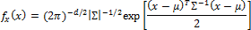
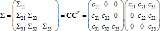
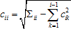
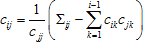
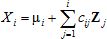

# Многомерное нормальное распределение

Многомерное нормальное распределение
-

# Многомерное нормальное распределение

Функция плотности многомерного нормального распределения для любого
 вектора x в d-мерном
 пространстве определяется как:

Где:

	- μ = (μ1,
	 μ2, …, μd)T.
	 Вектор средних значений;

	- Σ. Ковариационная матрица
	 с (i, j)-м
	 элементом Σij = Cov(Xi, Xj).
	 Поэтому Σ является симметричной и положительно определенной;

	- |Σ|. Определитель матрицы
	 Σ;

	- Σ-1.
	 Матрица, обратная Σ.

Поскольку матрица Σ является симметричной и положительно определенной,
 то её можно разложить на множители Σ = CCT
 (так называемое разложение Холецкого), где матрица C
 с числом строк и столбцов d×d является нижним треугольником.
 Приняв обозначение, что cij является
 (i, j)-м
 элементом матрицы C, то алгоритм
 для генерирования искомого вектора X
 с нормальным многомерным распределением будет иметь следующий вид:

	- Выполнение разложения Холецкого матрицы Σ для нахождения такой
	 матрицы C, которая удовлетворяет
	 условию Σ = CCT,
	 является нижней треугольной и содержит строго положительные элементы
	 на диагонали:

Элементы матрицы C
 вычисляются по следующим формулам:

при j < i:

	- Генерирование выборок Z1, Z2, …, Zd
	 из независимых и одинаково распределенных величин с распределением
	 N(0, 1), каждая выборка
	 содержит по n элементов.
	 При этом используется метод Бокса-Мюллера (см. описание [нормального
	 распределения](Lib_NormalDistribution.htm)).

	- Принять для i = 1, 2, …, d:

	- Возвращается значение X = (X1, X2, …, Xd)T.
	 В матричной записи X = μ + CZ.

См. также:

[ISmMultiNormalDistribution](StatLib.chm::/Interface/ISmMultiNormalDistribution/ISmMultiNormalDistribution.htm)
 | [Библиотека
 методов и моделей](../../uimodelling_lib_common.htm)

		Справочная
		 система на версию 10.9
		 от 18/08/2025,
		 © ООО «ФОРСАЙТ»,
