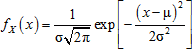
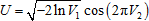

# Нормальное распределение

Нормальное распределение
-

# Нормальное распределение

Нормальное (гауссово) распределение характеризуется функцией плотности вероятности:

Где:

-
μ. Математическое ожидание случайной величины;

-
σ. Стандартное отклонение случайной величины.

Для моделирования нормально распределенных случайных величин использовано преобразование Бокса-Мюллера, позволяющее трансформировать равномерно распределенные случайные величины в случайные величины со стандартным нормальным распределением.

Генерирование вектора X (размерности n) псевдослучайных чисел, подчиняющихся нормальному распределению с заданными параметрами μ и σ, производится путём выполнения следующих операций:

1. Генерирование двух векторов V1 и V2 (размерности n) независимых псевдослучайных чисел, элементы которых подчиняются равномерному распределению на интервале (0, 1)..

2. Получение вектора U, элементы которого являются реализациями случайной величины, имеющей стандартное нормальное распределение с математическим ожиданием 0 и дисперсией 1, и вычисляются по следующей формуле: .

3. Получение искомого вектора X по формуле .

См. также:

[ISmNormalDistribution](StatLib.chm::/Interface/ISmNormalDistribution/ISmNormalDistribution.htm) | [IStatistics.NormDist](StatLib.chm::/Interface/IStatistics/IStatistics.NormDist.htm) | [Библиотека методов и моделей](../../uimodelling_lib_common.htm)

		Справочная
		 система на версию 10.9
		 от 18/08/2025,
		 © ООО «ФОРСАЙТ»,
