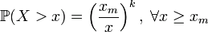
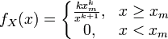

# Распределение Парето

Распределение Парето
-

# Распределение Парето

Распределение Парето в теории вероятностей - это непрерывное распределение, ограниченное снизу.

Пусть случайная величина X такова, что её распределение задаётся равенством:

Где xm, k > 0. Тогда говорят, что X имеет распределение Парето с параметрами xm и k. Плотность распределения Парето имеет вид:

См. также:

[ISmParetoDistribution](StatLib.chm::/Interface/ISmParetoDistribution/ISmParetoDistribution.htm) | [Библиотека методов и моделей](../../uimodelling_lib_common.htm)

		Справочная
		 система на версию 10.9
		 от 18/08/2025,
		 © ООО «ФОРСАЙТ»,
