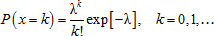

# Распределение Пуассона

Распределение Пуассона
-

# Распределение Пуассона

Распределение Пуассона - это дискретное распределение, являющееся одним
 из важных предельных случаев [биномиального
 распределения](Lib_BinomialDistribution.htm). При росте n
 и зафиксированном значении произведения np=λ > 0 биномиальное распределение
 B(n,p) сходится к распределению Пуассона.

Функция плотности вероятности задаётся формулой:

Где:

	- λ. Интенсивность событий,
	 положительное действительное число, равное ожидаемому значению количества
	 событий, произошедших в течение заданного интервала;

	- k.
	 Число появлений события, вероятность которого определяется указанной
	 функцией.

Для моделирования случайных величин используется алгоритм, основывающийся
 на соотношении распределения Пуассона с параметром λ и экспоненциального
 распределения с параметром (1/λ). Таким образом, для генерирования выборки
 из псевдослучайной величины X ~ P(λ) выполняются следующие операции:

	- Принимается a = e–λ,
	 b = 1 и i = 0.

	- Генерируется псевдослучайное число ui+1 ~ U(0, 1) из непрерывного равномерного
	 распределения на отрезке (0, 1), после чего присваиваются значения
	 b = b·ui+1.

	- Если b < a, то возвращается значение x = i,
	 в противном случае происходит переход к шагу 2 при i = i + 1.

См. также:

[IStatistics.Poisson](StatLib.chm::/Interface/IStatistics/IStatistics.Poisson.htm)
 | [IStatistics.Poisson](StatLib.chm::/Interface/IStatistics/IStatistics.Poisson.htm)
 | [Библиотека
 методов и моделей](../../uimodelling_lib_common.htm)

		Справочная
		 система на версию 10.9
		 от 18/08/2025,
		 © ООО «ФОРСАЙТ»,
