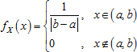

# Равномерное распределение

Равномерное распределение
-

# Равномерное распределение

Непрерывное равномерное распределение на интервале (0, 1) характеризуется функцией плотности вероятности fX(x) = 1 на (0,1); fX(x) = 0 вне (0,1).

Непрерывное равномерное распределение на интервале (a, b) характеризуется функцией плотности вероятности:

Функция вычисляет значения xi = a + (b − a)vi (при условии a < b), при этом выборка псевдослучайных чисел v1, …, vn генерируется из стандартного равномерного распределения на отрезке (0, 1). Предполагается, что значения x1, …, xn лежат в интервале (a, b).

См. также:

[ISmUniformDistribution](StatLib.chm::/Interface/ISmUniformDistribution/ISmUniformDistribution.htm) | [Библиотека методов и моделей](../../uimodelling_lib_common.htm)

		Справочная
		 система на версию 10.9
		 от 18/08/2025,
		 © ООО «ФОРСАЙТ»,
