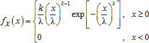
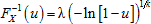
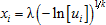

# Распределение Вейбулла

Распределение Вейбулла
-

# Распределение Вейбулла

Двухпараметрическое распределение Вейбулла с параметрами формы k > 0 и масштаба λ
 > 0 характеризуется функцией плотности вероятности:

Для моделирования случайных величин использован метод обратного преобразования,
 позволяющий при наличии генератора выборки из стандартного непрерывного
 равномерного распределения получить выборку из распределения Вейбулла.
 Используется свойство, что если случайная величина U ~ U(0, 1) распределена равномерно
 на отрезке (0, 1), то случайная величина X = λ(ln(U))1/k
 имеет распределение Вейбулла W(k, λ)
 с параметрами k и λ. Генерирование
 выборки x1, …, xn
 производится путём выполнения следующих операций:

	- Генерирование выборки u1, …, un
	 псевдослучайных чисел из стандартного непрерывного равномерного распределения
	 на интервале (0, 1).

	- На основании обратной функции , а также
	 с учетом того факта, что величины U
	 и 1 – U имеют одно
	 и то же распределение U(0, 1),
	 вычисляется выборка из искомого распределения Вейбулла по формуле:

См. также:

[IStatistics.Weibull](StatLib.chm::/Interface/IStatistics/IStatistics.Weibull.htm)
 | [ISmWeibullDistribution](StatLib.chm::/Interface/ISmWeibullDistribution/ISmWeibullDistribution.htm) |
 [Библиотека
 методов и моделей](../../uimodelling_lib_common.htm)

		Справочная
		 система на версию 10.9
		 от 18/08/2025,
		 © ООО «ФОРСАЙТ»,
