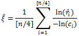
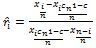
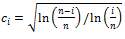
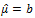
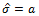
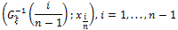
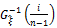

# Линейная комбинация показателей расстояний

Линейная комбинация показателей расстояний
-

# Линейная комбинация показателей расстояний

Пусть X
 - случайная величина с заданным законом распределения, описанным функцией
 F (X),
 где X1,…,Xn
 - выборка, каждый элемент которой
 является случайной величиной с тем же законом распределения, что и случайная
 величина X. Тогда на основе выборки
 можно оценить параметры функции F (X).

Пусть функция F (X) принадлежит семейству функций
 распределений экстремальных значений, тогда для оценки семейства параметров
 (μ, σ, ξ) необходимо использовать метод
 линейной комбинации показателей расстояний.

Рассмотрим подробнее оценку каждого параметра:

	- Оценка параметра формы ξ
	 основана на построении линейной комбинации:

Где:

		- 

		- 

		- xq
		 - выборочная квантиль уровня q.

	- Оценка параметров размещения μ
	 и масштаба σ получается путем
	 оценки параметров линейной регрессии вида y = ax + b,
	 где  и  соответственно.
	 Построение регрессии осуществляется по n-1
	 точке графика QQ (Quantile-Quantile
	 plot) с координатами:

Где  - квантиль
 распределения экстремальных значений.

См. также:

[Библиотека методов и моделей](../../uimodelling_lib_common.htm)

		Справочная
		 система на версию 10.9
		 от 18/08/2025,
		 © ООО «ФОРСАЙТ»,
