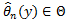
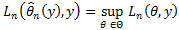
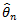
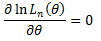

# Оценка методом максимального правдоподобия

Оценка методом максимального правдоподобия
-

# Оценка методом максимального правдоподобия

Метод максимального правдоподобия - это метод оценки неизвестного параметра путем максимизации функции правдоподобия.

Рассмотрим последовательность случайных величин {y1, y2,…}, не обязательно независимых или одинаково распределенных. Пусть hn (·,θ0) - совместная плотность распределения случайных величин y = (y1,…,yn). Предположим, что вид этой функции известен за исключением параметра θ0, который мы хотим оценить. Предполагается, что θ0 ∈ Θ, где множество возможных значений параметра Θ принадлежит конечному эвклидову пространству.

Для каждого фиксированного y вещественная функция

Ln (θ) = Ln (θ,y) = hn (y,θ), θ ∈ Θ,

Называется функцией правдоподобия, и её логарифм ln Ln (θ) называется логарифмической функцией правдоподобия.

Для фиксированного y любое значение , такое, что:

Называется оценкой максимального правдоподобия параметра θ0. В общем случае нет гарантии, что оценка параметра θ0 существует для всех значений y, но если это верно, то функция  называется оценкой максимального правдоподобия неизвестного параметра θ0.

Когда максимум достигается во внутреннем множестве пространства параметров Θ, а Ln (θ) является дифференцируемой по θ функцией, тогда вектор частных производных ∂ ln Ln (θ) / ∂θ в этой точке равен нулю. Таким образом, оценка  является решением векторного уравнения:

На практике для того, чтобы найти оценку максимального правдоподобия, придерживаются следующего алгоритма:

-
Строим функцию правдоподобия Ln (θ) на основе известной функции плотности hn (y,θ0) распределения случайной величины y;

-
Логарифмируем полученную на первом шаге функцию Ln (θ);

-
Находим первую частную производную ∂ ln Ln(θ) / ∂θ и приравниваем её к нулю. Решение полученного векторного уравнения даст вектор оценок .

См. также:

[Библиотека методов и моделей](../../uimodelling_lib_common.htm) | [IMLESettings](StatLib.chm::/Interface/IMLESettings/IMLESettings.htm)

		Справочная
		 система на версию 10.9
		 от 18/08/2025,
		 © ООО «ФОРСАЙТ»,
