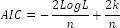
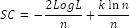
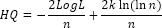

# Информационные критерии

Информационные критерии
-

# Информационные критерии

Информационные критерии используются для сравнения моделей с разным
 числом параметров, когда требуется выбрать наилучший набор объясняющих
 переменных. Данные критерии учитывают число наблюдений n
 и число параметров модели p и
 отличаются друг от друга видом «функции штрафа» за число параметров. Все
 критерии рассчитываются на основе [логарифма
 функции правдоподобия](UiModelling_LogL.htm) LogL,
 что позволяет применять их к широкому спектру моделей.

Для информационных критериев действует правило: наилучшая модель имеет
 наименьшее значение критерия.

## Информационный критерий Акаике (AIC)

Критерий рассчитывается по формуле:

## Информационный критерий Шварца (SC)

В отличие от критерия Акаике, критерий Шварца налагает больший «штраф»
 за использование дополнительных параметров:

## Информационный критерий Ханнана-Куина (HQ-критерий)

Данный критерий является ещё одной альтернативой критериев Акаике и
 Шварца:

См. также:

[Библиотека методов и моделей](../uimodelling_lib_common.htm)
 | [ISummaryStatistics.AIC](StatLib.chm::/Interface/ISummaryStatistics/ISummaryStatistics.AIC.htm)
 | [ISummaryStatistics.SC](StatLib.chm::/Interface/ISummaryStatistics/ISummaryStatistics.SC.htm)
 | [ISummaryStatistics.HQcriterion](StatLib.chm::/Interface/ISummaryStatistics/ISummaryStatistics.HQcriterion.htm)

		Справочная
		 система на версию 10.9
		 от 18/08/2025,
		 © ООО «ФОРСАЙТ»,
