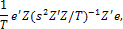

# J-статистика

J-статистика
-

# J-Статистика

J-статистика используется для проверки гипотезы о значимости регрессионной модели, рассчитанной [методом инструментальных переменных](../01_Regression_models/UiModelling_LinearRegr_Method_Instr_Var.htm).

Значение J-статистики рассчитывается по формуле:

где:

-
e. Вектор остатков модели регрессии;

-
s. Стандартная ошибка регрессии;

-
Z. Матрица инструментальных переменных;

-
T. Количество наблюдений.

Данная величина имеет [распределение Хи-квадрат](Distribution/Lib_Chi2Distribution.htm) со степенью свободы p-k, где k - количество оцениваемых коэффициентов, p - число инструментальных переменных.

## Вероятность J-статистики

Нулевая гипотеза о равенстве нулю коэффициентов при всех регрессорах отклоняется, если вероятность меньше, чем уровень значимости. Рассматривают один из стандартных уровней значимости: 0.1, 0.05 или 0.01.

См. также:

[Библиотека методов и моделей](../uimodelling_lib_common.htm) | [ISummaryStatistics.Jstat](StatLib.chm::/Interface/ISummaryStatistics/ISummaryStatistics.Jstat.htm) | [ISummaryStatistics.ProbJstat](StatLib.chm::/Interface/ISummaryStatistics/ISummaryStatistics.ProbJstat.htm)

		Справочная
		 система на версию 10.9
		 от 18/08/2025,
		 © ООО «ФОРСАЙТ»,
