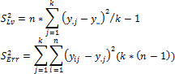
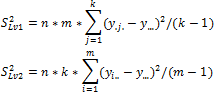
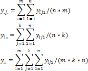
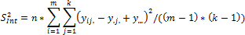

# Дисперсионный анализ

Дисперсионный анализ
-

**

# Дисперсионный анализ

Дисперсионный анализ (от латинского Dispersio – рассеивание / на английском
 Analysis Of Variance - ANOVA) применяется для исследования влияния одной
 или нескольких качественных переменных (факторов) на одну зависимую количественную
 переменную.

## Однофакторный дисперсионный анализ

Однофакторный дисперсионный анализ применяется для проверки гипотезы
 о равенстве математических ожиданий нескольких генеральных совокупностей.
 Например, если необходимо выяснить, оказывает ли влияние входная x** на выходную зависимую переменную **y**. В данном примере входная переменная **x** принимает дискретные
 значения, а выходная переменная **y**
 является непрерывной случайной величиной, вероятностная природа которой
 обусловлена наличием аддитивной помехи **e**.

Однофакторный дисперсионный анализ базируется на следующих предпосылках:

	- В каждом наблюдении ei имеет нормальное
	 распределение с нулевым математическим ожиданием и конечной дисперсией.

	- Для любого i дисперсия
	 ei
	 является величиной постоянной.

Рассмотрим вычислительную процедуру однофакторного дисперсионного анализа.
 Пусть x принимает k
 различных значений или, как говорят, фактор x
 имеет k уровней. Пусть на каждом
 из уровней имеется n наблюдений
 выходной величины y. Тогда результаты
 можно представить в виде таблицы (столбцы - уровни фактора x, строки
 - наблюдения y):

		 № наблюдения
		 Уровни входного фактора x

		 1
		 2
		 …
		 j
		 …

		 1
		 y11
		 y12
		 …
		 y1j
		 …

		 2
		 y21
		 y22
		 …
		 y2j
		 …

		 …
		 …
		 …
		 …
		 …
		 …

		 i
		 yi1
		 yi2
		 …
		 yij
		 …

		 …
		 …
		 …
		 …
		 …
		 …

		 n
		 yn1
		 yn2
		 …
		 ynj
		 …

Если уровни фактора **x**
 не оказывают влияние на математическое ожидание **y**, то
 все наблюдения представляют собой выборку из одной генеральной совокупности
 (при условии выполнения приведенных выше предпосылок). Тогда, дисперсию
 генеральной совокупности можно оценить двумя независимыми оценками: через
 средние значения **y**
 для каждого из уровней **x**
 или как среднее арифметическое оценок дисперсий **y**
 для каждого из уровней **x**.
 Первая оценка называется оценкой дисперсии уровней **S2Lv**, вторая
 - оценкой дисперсии ошибки **S2Err**.

Где:

	- **y.j**. Среднее по **j**-му
	 уровню;

	- **y..**. Общее среднее.

Если влияние уровней фактора **x** на математическое ожидание отсутствует,
 то отношение **F
 = S2Lv/S2Err**
 подчинено закону [распределения
 Фишера](Distribution/Lib_FisherDistribution.htm). Характеристики этого распределения зависят от числа степеней
 свободы оценок **S2Lv**
 и **S2Err**
 (числа степеней свободы числителя **ν****1=(k-1)**
 и знаменателя **ν****2=k*(n-1)**). Для любого заданного
 уровня значимости **α** всегда
 существует критическое значение **Fcrit**, превысить
 которое **F** при
 отсутствии влияния уровней **x**
 может с вероятностью не более **α**.
 Это означает, что если в результате обработки данных расчетное значение
 **[F-статистики](UiModelling_Fisher.htm)**
 превысит соответствующее **Fcrit**, то
 данные противоречат гипотезе о равенстве математических ожиданий **y** для всех уровней **x**.
 Если **F<****Fcrit**, то
 данные не противоречат этой гипотезе, и следует считать, что уровни **x** не оказывают
 влияние на математическое ожидание **y**.

## **Двухфакторный
 дисперсионный анализ**

В двухфакторном дисперсионном анализе проверяется гипотеза о равенстве
 математических ожиданий выходного контролируемого параметра **y** при различных уровнях двух факторов.

В этой модели входные переменные **x1 и x2** принимают
 дискретные значения, а выходная переменная **y**
 является непрерывной случайной величиной, вероятностная природа которой
 обусловлена наличием аддитивной помехи **e**.

Двухфакторный дисперсионный анализ
 базируется на следующих предпосылках:

	- В каждом наблюдении ei имеет нормальное
	 распределение с нулевым математическим ожиданием и конечной дисперсией.

	- Для любого i
	 дисперсия ei является величиной постоянной.

Рассмотрим вычислительную процедуру двухфакторного дисперсионного анализа.
 Пусть **x1**
 принимает **k** различных
 значений или фактор **x1**
 имеет **k** уровней,
 **x2** принимает **m**
 различных значений или фактор **x2** имеет m уровней. Пусть на
 каждом из сочетаний уровней имеется n
 наблюдений выходной величины y.
 Тогда результаты можно представить в виде таблицы:

		 Уровни входного фактора x2
		 Уровни входного фактора x1

		 1
		 2
		 …
		 j
		 …

		 1
		 y111 … y11n
		 y121 … y12n
		 …
		 y1j1 … y1jn
		 …

		 2
		 y211 … y21n
		 y221 …
		 y22n
		 …
		 y2j1 … y2jn
		 …

		 …
		 …
		 …
		 …
		 …
		 …

		 i
		 yi11 …
		 yi1n
		 yi21 … yi2n
		 …
		 yij1 …
		 yijn
		 …

		 …
		 …
		 …
		 …
		 …
		 …

		 m
		 ym11 …
		 ym1n
		 ym21 … ym2n
		 …
		 ymj1 …
		 ymjn
		 …

Если уровни факторов **x1**
 и **x2** не оказывают влияние на математическое
 ожидание y, то все наблюдения
 представляют собой выборку из одной генеральной совокупности (при условии
 выполнения приведенных выше предпосылок). Тогда, дисперсию генеральной
 совокупности можно оценить следующими независимыми оценками: через средние
 значения y для каждого из уровней
 факторов **x1**
 или **x2** или как среднее арифметическое
 оценок дисперсий y для каждого
 из уровней **x1**
 или **x2**. Как и в однофакторном дисперсионном
 анализе, первая оценка называется оценкой дисперсии уровней **S2Lv**, вторая
 - оценкой дисперсии ошибки **S2Err**.

Для первого и второго факторов имеем:

Где:

	- **y.j.**. Среднее по **j**-му
	 уровню первого фактора;

	- **yi..**. Среднее по i-му
	 уровню второго фактора;

	- **y...**. Общее среднее.

Оценка дисперсии ошибки вычисляется по формуле:

Где:

	- **yij.**. Среднее значение y
	 при **j**-у уровне
	 первого фактора и i-м уровне
	 второго фактора.

Наличие двух факторов позволяет использовать еще одну оценку дисперсии
 - взаимодействия:

Если влияние уровней факторов x1
 и x2 на математическое
 ожидание отсутствует, то отношения F1=S2Lv1/S2Err,
 F2=S2Lv2/S2Err и **FInt=S2Int/S2Err подчинены
 закону [распределения
 Фишера](Distribution/Lib_FisherDistribution.htm). Характеристики этого распределения зависят от числа степеней
 свободы оценок S2Lv1,
 S2Lv2,
 S2Int и S2Err (числа
 степеней свободы числителя** **ν****1=(k-1),** **ν****2=(m-1),** **ν****Int=(m-1)*(k-1)
 и знаменателя** **ν****Err=m*k*(n-1)
 ). Для любого заданного уровня значимости** **α**
 **всегда существует критическое значение
 Fcrit,
 превысить которое F при отсутствии
 влияния уровней факторов x1, x2 и их взаимодействия x1*x2 может с вероятностью не более**
 **α****.
 Это означает, что если в результате обработки данных расчетное значение
 [F-статистики](UiModelling_Fisher.htm) превысит соответствующее
 Fcrit,
 то данные противоречат гипотезе о равенстве математических ожиданий y
 для всех уровней факторов** **x1, x2 и их взаимодействия ****x1*x2.
 Если F<Fcrit, то данные не противоречат этой гипотезе,
 и следует считать, что уровни не оказывают влияние на математическое ожидание
 y.**

См. также:

[Библиотека методов и моделей](../uimodelling_lib_common.htm)
 | [ISmVarianceAnalysis](StatLib.chm::/Interface/ISmVarianceAnalysis/ISmVarianceAnalysis.htm)

		Справочная
		 система на версию 10.9
		 от 18/08/2025,
		 © ООО «ФОРСАЙТ»,
