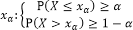

# Квантиль

Квантиль
-

# Квантиль

Квантиль - одна из числовых характеристик
 случайных величин, применяемая в математической статистике. Пусть (Ω,Σ,Ρ) вероятностное
 пространство для которого Ρx - вероятностная
 мера задающая распределение некоторой случайной величины X и
 пусть α ϵ (0,1), тогда квантилью уровня α распределения Ρx называется
 число , такое, что:

## Часто используемые квантили специальных видов

	- Процентиль. xp/100,
	 где p =1, …, 99.

	- Дециль. xp/10,
	 где p = 1, …, 9.

	- Квартиль. xp/4,
	 где p=1,…,4. Выделяют верхнюю
	 x0,75 и
	 нижнюю x0,25
	 квартили.

	- [Медиана](UiModelling_Median.htm).
	 x0,5.
	 Средний показатель распределения.

См. также:

[Библиотека методов и моделей](../uimodelling_lib_common.htm)

		Справочная
		 система на версию 10.9
		 от 18/08/2025,
		 © ООО «ФОРСАЙТ»,
