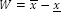

# Размах

Размах
-

# Размах

Размах W - разность между
 наибольшим и наименьшим значениями ряда. Пусть X:
 (x1, x2, …, xn)
 - исследуемый ряд, x - минимальное значение ряда X, x̅
 - максимальное значение ряда X,
 тогда:

См. также:

[Библиотека методов и моделей](../uimodelling_lib_common.htm)

		Справочная
		 система на версию 10.9
		 от 18/08/2025,
		 © ООО «ФОРСАЙТ»,
