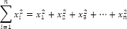

# Сумма квадратов

Сумма квадратов
-

# Сумма квадратов

Пусть X: (x1, x2, …, xn) - исследуемый
 ряд, тогда сумма квадратов ряда X:

См. также:

[Библиотека методов и моделей](../uimodelling_lib_common.htm)

		Справочная
		 система на версию 10.9
		 от 18/08/2025,
		 © ООО «ФОРСАЙТ»,
