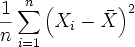
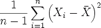

# Дисперсия

Дисперсия
-

# Дисперсия

Дисперсия - отклонение наблюдаемого значения (для каждого наблюдения) от среднего арифметического.

## Выборочная дисперсия

Вычисляется по следующей формуле:

Где:

-
X. [Выборочное среднее](UiModelling_Avg.htm);

-
n. Размер выборки.

## Исправленная дисперсия

Если размер выборки относительно ограничен, то для более точного расчета применяется формула несмещенной (исправленной) дисперсии:

Где:

-
X. [Выборочное среднее](UiModelling_Avg.htm);

-
n. Размер выборки.

См. также:

[Библиотека методов и моделей](../uimodelling_lib_common.htm) | [IModelling.Variance](KeMs.chm::/Interface/IModelling/IModelling.Variance.htm)

		Справочная
		 система на версию 10.9
		 от 18/08/2025,
		 © ООО «ФОРСАЙТ»,
