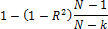
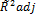
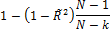
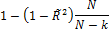
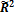

# Скорректированный коэффициент детерминации (AdjR2/нецентрированный)

Скорректированный коэффициент детерминации (AdjR2/нецентрированный)
-

# Скорректированный коэффициент детерминации

Скорректированный коэффициент детерминации (R2adj) - [коэффициент детерминации](UiModellind_DetermCoeff_R2.htm), скорректированный на число факторов, и не чувствительный к числу регрессоров. R2adj рассчитывается по формуле:

Где:

-
R2. Коэффициент детерминации.

Для R2adj, рассчитанного по такой формуле, соотношение 0 ≤ R2adj ≤ 1 будет выполняться только для модели с оцениваемой константой.

Нецентрированный скорректированный коэффициент детерминации () учитывает это условие и рассчитывается в зависимости от наличия константы:

 Значение константы оценивается
 Константа не используется
 Значение константы задается вручную

 
 
 

Где:

-
. Коэффициент детерминации (нецентрированный);

-
k. Количество факторов, включенных в модель;

-
N. Количество наблюдений.

При k>1 R2adj ≤ R2.

Предпочтительней модель с наибольшим значением критерия. Таким образом, при сравнении моделей множественной регрессии следует обращать внимание именно на значение R2adj.

См. также:

[Библиотека методов и моделей](../uimodelling_lib_common.htm) | [Коэффициент детерминации](UiModellind_DetermCoeff_R2.htm) | [ISummaryStatistics.AdjR2](StatLib.chm::/Interface/ISummaryStatistics/ISummaryStatistics.AdjR2.htm) | [ISummaryStatistics.AdjR2_2](StatLib.chm::/Interface/ISummaryStatistics/ISummaryStatistics.AdjR2_2.htm)

		Справочная
		 система на версию 10.9
		 от 18/08/2025,
		 © ООО «ФОРСАЙТ»,
