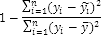
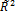
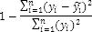
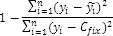
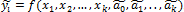
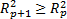

# Коэффициент детерминации (R^2/нецентрированный)

Коэффициент детерминации (R^2/нецентрированный)
-

# Коэффициент детерминации

Коэффициент детерминации (R2) рассматривают,
 как правило, в качестве основного показателя, отражающего меру качества
 регрессионной модели, описывающей связь между зависимой и независимыми
 переменными модели. R2 рассчитывается по формуле:

R2
 показывает, какую часть изменчивости наблюдаемой переменной можно объяснить
 с помощью построенной модели, т.е. значение коэффициента детерминации
 определяет долю (в процентах) изменений, обусловленных влиянием факторных
 признаков, в общей изменчивости результативного признака.

Значение R2
 должно находиться в диапазоне от нуля до единицы: 0 ≤ R2 ≤ 1.
 Модель считается более качественной, если значение коэффициента детерминации
 близко к 1. Если R2=1,
 то эмпирические точки (xi; yi) лежат точно
 на линии регрессии и между переменными Y и Х существует линейная функциональная
 зависимость. Если R2=0, то вариация зависимой переменной полностью
 обусловлена неучтенными в модели факторами.

Для сравнения качества моделей с константой и без используется нецентрированный
 коэффициент детерминации (). В зависимости от наличия
 константы в модели нецентрированный коэффициент детерминации рассчитывается
 различными методами:

		 Значение константы оценивается
		 Константа не используется
		 Значение константы задается вручную

		 
		 
		 

Где:

	- yi.
	 Значения наблюдаемой переменной;

	- . Среднее значение
	 по экспериментальным (наблюдаемым) данным;

	- . Модельные значения,
	 построенные по оцененным параметрам;

	- Cfix.
	 Фиксированное значение константы.

Таким образом, значение  всегда находится в диапазоне
 от 0 до 1

Однако использование коэффициента детерминации для сравнения качества
 моделей с разным количеством включенных в модель регрессоров некорректно,
 так как R2
 возрастает при увеличении количества факторов регрессии. Добавление в
 модель новой характеристики не уменьшает значение R2, так как
 каждая последующая переменная может лишь дополнить, но никак не сократить
 информацию, объясняющую поведение зависимой переменной .
 Чтобы устранить эффект роста, коэффициент детерминации корректируют на
 число факторов. Такой коэффициент называют [скорректированным
 коэффициентом детерминации](UiModellind_DetermCoeff_AdjR2.htm).

См. также:

[Библиотека методов и моделей](../uimodelling_lib_common.htm)
 | [Скорректированный коэффициент
 детерминации](UiModellind_DetermCoeff_AdjR2.htm) | [ISummaryStatistics.R2](StatLib.chm::/Interface/ISummaryStatistics/ISummaryStatistics.R2.htm)
 | [ISummaryStatistics.R2_2](StatLib.chm::/Interface/ISummaryStatistics/ISummaryStatistics.R2_2.htm)

		Справочная
		 система на версию 10.9
		 от 18/08/2025,
		 © ООО «ФОРСАЙТ»,
