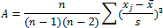

# Показатель асимметрии

Показатель асимметрии
-

# Показатель асимметрии

Показатель асимметрии (A) рассчитывается по формуле:

,

где:

-
s. [Стандартное отклонение](UiModelling_Stddev.htm) по выборке;

-
n. Размер выборки;

-
xj. j-тый элемент выборки;

-
. [Среднее значение](UiModelling_Avg.htm).

Если А < 0, то это означает, что преобладают данные с большими значениями, а если А > 0, то больше данных с меньшими значениями, чем средне арифметическое.

См. также:

[Библиотека методов и моделей](../uimodelling_lib_common.htm)

		Справочная
		 система на версию 10.9
		 от 18/08/2025,
		 © ООО «ФОРСАЙТ»,
