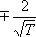
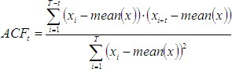
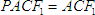
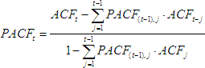
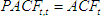
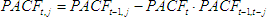
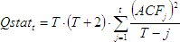

# Автокорреляционный анализ

Автокорреляционный анализ
-

# Автокорреляционный анализ

Автокореляция k-ого порядка (ACFk) от временного
 ряда X - это мера тесноты и направления
 линейной стохастической зависимости между текущими значениями временного
 ряда и значениями временного ряда на k
 моментов времени назад. Другими словами, автокорреляция - это «чистая
 корреляция» между Xt и Xt-k.

Частная автокореляция k-ого
 (PACFk)
 порядка от временного - это мера тесноты и направления линейной стохастической
 зависимости между текущими значениями временного ряда и значениями временного
 ряда на k моментов времени назад,
 при исключении влияния промежуточных значений Xt-1, Xt-2, …, Xt-k+1.

Пусть Х - исходный временной
 ряд, Т - длина временного ряда.

Стандартная ошибка:

Автокорреляционная функция (ACF):

t
 = 1... лаг.

Частная автокорреляционная функция (PACF):

t
 = 1... лаг.

Q-статистика:

t
 = 1...лаг.

См. также:

[Библиотека методов и моделей](../uimodelling_lib_common.htm)
 | [ISmAutoCorrelation](StatLib.chm::/Interface/ISmAutoCorrelation/ISmAutoCorrelation.htm) |
 [SmAutoCorrelation](StatLib.chm::/Class/SmAutoCorrelation/SmAutoCorrelation.htm)
 | [ISmPartialCorrelation](StatLib.chm::/Interface/ISmPartialCorrelation/ISmPartialCorrelation.htm) |
 Моделирование и прогнозирование: [АКФ
 и ЧАКФ](uimodelling.chm::/2_Container_of_Modeling/2_3_Work_object/2_3_5_Descriptive_Value/uimodelling_work_object_AKF.htm)

		Справочная
		 система на версию 10.9
		 от 18/08/2025,
		 © ООО «ФОРСАЙТ»,
